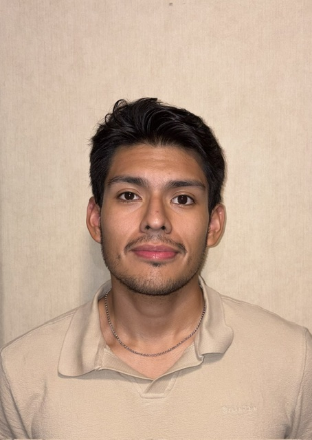

+++
title = "About"
draft = false
+++

Hello, I am Santiago!

I'm currently an Electrical Engineer at JHU Applied Physics Lab working in the area of Communication Systems. My professional and academic work has been in the wireless PHY layer from receiver algorithm design to real-time DSP pipeline implementation in HDL and system-level software. Throughout my career, I have been passionate about tackling low latency and resource-constrained design challenges. 

I have a master's degree in Electrical Engineering from Colorado School of Mines and dual bachelor's degrees in Computer Science and Mechanical Engineering.

The projects in this portfolio reflect my physical layer interests: RTL design, bare-metal firmware, receiver algorithm modeling, and even some RF frontend. Building these projects helped me understand how wireless systems work from antenna to bits.

---

## Technical Skills

### Digital Signal Processing
- Extended Kalman Filter for nonlinear state estimation: carrier phase, frequency offset, drift, and amplitude tracking in QPSK receiver
- Direct Digital Synthesis using phase accumulator + LUT architecture; ADC interface design (16-bit SAR, ±5 V, 200 kS/s)
- Real-time digital filtering and spectral analysis on live IQ streams from an SDR receiver
- Digital filter design (FIR/IIR), state-space modeling in discrete time, and signal simulation in MATLAB and Simulink

### Real-Time Software Development
- Designed real-time UDP IQ packet processing from an SDR, with FIFO buffering to decouple packet arrival from downstream digital filtering
- Thread synchronization using mutexes in C++ to prevent race conditions between producer and consumer threads
- SDR radio control via API: Sent acquisition parameters like sampling rate, center frequency, gain, etc via TCP

### Embedded Systems, Firmware & PCB Design
- PCB design in KiCad and Breadboard protptyping; hardware debugging with oscilloscopes and VNAs
- Bare-metal firmware on ARM Cortex-A9 (Xilinx Vitis): AXI4-Lite memory-mapped register control
- Interrupt-driven architecture using hardware timers (TTC0 at 10 kHz) for real-time waveform generation
- PS–PL handshake protocol: flag/acknowledge signaling between ARM software and FPGA fabric

### FPGA & Digital Design
- RTL design in VHDL on Xilinx Zynq-7010: datapath/control FSM architecture, custom AXI4-Lite slave IP, Vivado block design
- Datapath and control architecture: FSM-driven control word / status word separation
- Dual-port BRAM for cross-clock-domain buffering; acquisition clock to pixel clock
- Simulation and timing verification in ModelSim / Vivado

### RF & Electromagnetics
- Full-wave EM simulation in Ansys HFSS antenna design, parametric sweeps, Optimetrics optimization
- Microstrip patch antenna design including impedance matching, coax. feed, circular polarization, and array configuration
- Circular array design with mutual coupling analysis and HFSS full-array verification
- PCB fabrication on Rogers substrates using CNC milling; S-parameter analysis via VNA measurement

### Tools & Platforms
| Category | Tools |
|---|---|
| Software | C, C++, MATLAB, VHDL, Verilog, Python |
| FPGA | Xilinx Vivado, Vitis, Quartus Prime |
| Embedded/PCB | Microchip MPLab, GCC toolchain, KiCad |
| EM Simulation | Ansys HFSS |
| Tools | Git, GitHub, Docker, Wireshark |
| OS | Windows, Ubuntu Linux |

---

## Experience

### Electrical Engineer — JHU Applied Physics Lab
*July 2026 – Present*

Designing low latency DSP pipeline in systems-level software to interface with software-defined radio.

### Embedded Systems and Digital Logic Lab Assistant
*Jan. 2026 – May 2026*

In Embedded Systems, taught students C programming with MPLab IDE as well as MCU debugging with oscilloscopes. In Digital Logic, helped students with Verilog FPGA programming in Quartus, finite state machines, and testbenching.

### Machine Learning/Data Science Teaching Assistant
*August 2025 – December 2025*

Helping students with Jupyter Notebooks and ML algorithms for real-world applications.

### Software Engineer Intern — JHU Applied Physics Lab
*May 2025 – August 2025*

Developed agentic AI pipeline for Retrieval-Augmented Generation (RAG). Designed and simulated LPI/LPD digital spread spectrum communication systems like FHSS and DSSS. Built autonomous drone tracking system with on board computer vision and control.

### Data Science Intern — Pan American Energy
*May 2024 – August 2024*

Designed an algorithm and Python tool to aid with oil field drilling locations using dynamic time warping with electric resistivity profiles.

---

## Education

### Colorado School of Mines
*M.S. Electrical Engineering* — May 2026

*B.S. Computer Science (Magna Cum Laude)* — May 2025

*B.S. Mechanical Engineering (Magna Cum Laude)* — May 2025

Organizations: Tau Beta Pi, SHPE, Boettcher Scholarship, Kappa Sigma

---

*Contact Info: Connect on [LinkedIn](https://www.linkedin.com/in/santiagoalejandro-castillo/) and/or [Github](https://github.com/scast3)*