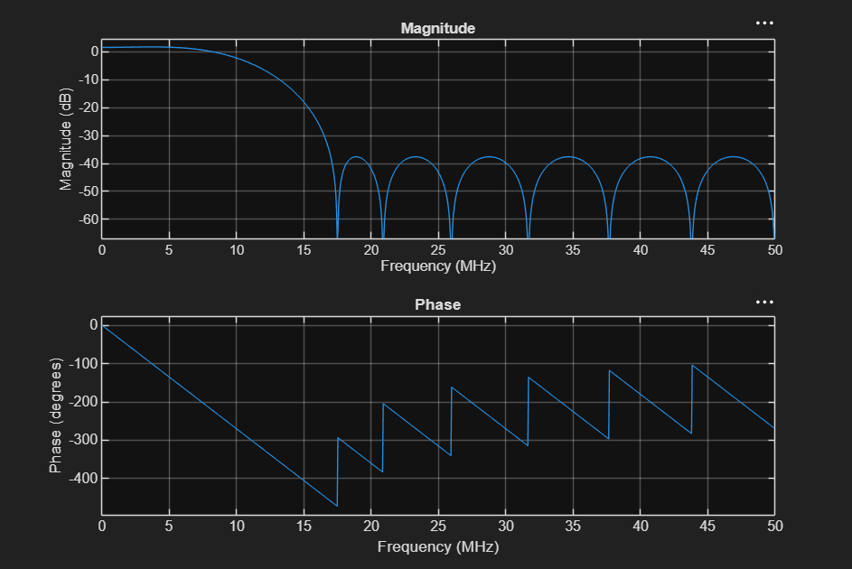

## Overview

Designing an FIR Filter in Matlab and implementing in C++ and VHDL to perform optimization. The filter parameters were:

- Sampling Rate: 100 MHz
- Passband: 10 MHz
- Stopband: 15 MHz

## Theoretical Design

The filter was first designed in matlab to determine the minimum amount of taps, and to find the corresponding FIR coefficients.

```matlab
rp = 3;
rs = 40;
fs = 100e6;
Fpass = 10e6;
Fstop = 17e6;
dev = [(10^(rp/20)-1)/(10^(rp/20)+1) 10^(-rs/20)]; 
[n, fo, ao , w]=firpmord([Fpass Fstop],[1 0],dev,fs);
b = firpm(n,fo,ao,w);
freqz(b,1,1024,fs)
fprintf('b(%d) = %.6f\n', [1:length(b); b]);
fprintf('%.6f\n',b');
```
The response of the theoretical filter can be seen below:



## Implementation
Using the 16 FIR coefficients from the Parks-McClellan optimal FIR filter order estimation, I could now move on to translating the math into floating point arithmetic. This was done by implementing the convolution equation:
$$y(n)=\sum^{M-1}_{k=0}h(k)*x(n-k)$$
### C++ Design
This was implemented in C++ using a circular buffer
```cpp
class FIR {
private:
	std::vector<double> h;
	std::vector<double> x;
	size_t n;
	size_t M;

public:
	FIR(const std::vector<double>& coeffs) : 
        h(coeffs), 
        x(coeffs.size(), 0.0), 
        n(0), 
        M(coeffs.size()) 
    {}
	

	double process(double sample){
		x[n]=sample;
		double y_n = 0.0;
		size_t idx = n;

		for (size_t k = 0; k<M; k++){
			y_n += h[k]*x[idx];
			idx = (idx==0) ? M - 1 : idx-1;
		}
		n++;
		if (n==M) n=0;
			
		return y_n;
	}
};
```
### VHDL Design