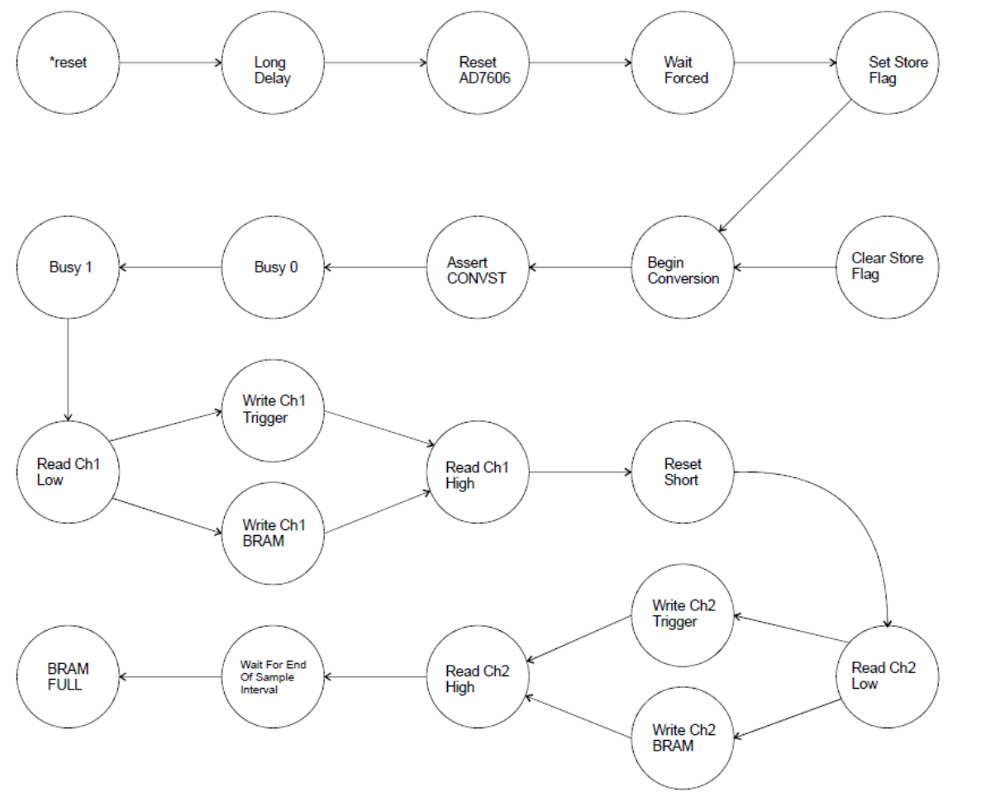
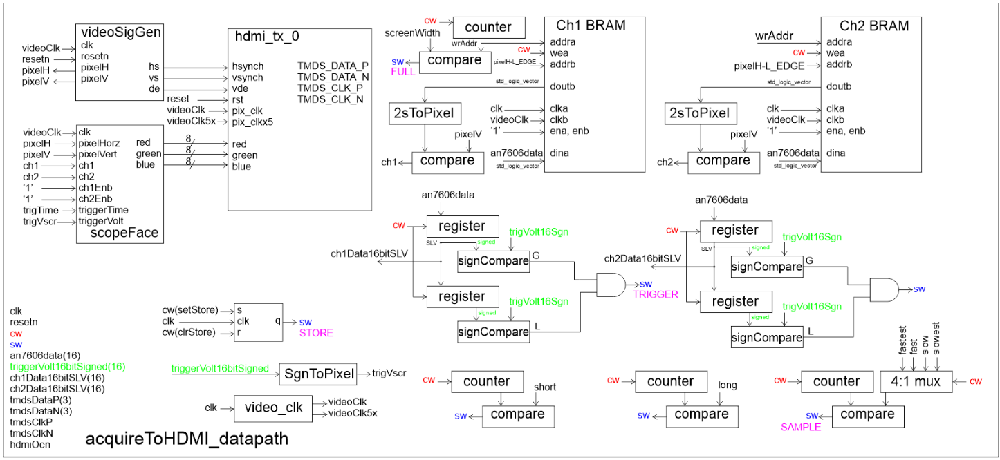
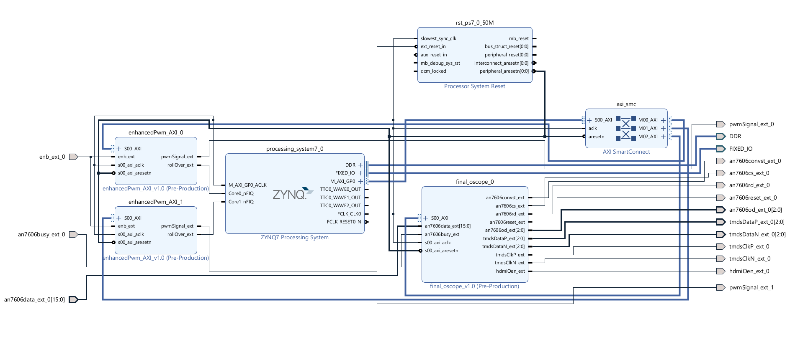

## Overview

This project is the hardware/software co-design of a two-channel oscilloscope on the Xilinx Zynq-7010 SoC. The design captures analog signals from the AD7606 ADC and displays the waveforms in real time over HDMI. The design splits responsibility across two domains on the same chip: programmable logic (PL) which is implemented in VHDL, handles the acquisition and video pipeline which is very timing-dependent, while the ARM Cortex-A9 processing system (PS) runs embedded C firmware for user control through a command line interface.

The two domains communicate through a custom AXI4-Lite slave peripheral, giving the ARM processor memory-mapped access to control registers, status flags, and live sample data in the FPGA fabric.


<div style="width: 500px; margin: 0 auto; text-align: center;">


</div>

---

## System Architecture

The top-level VHDL entity `acquireToHDMI` is packaged in an IP named `final_oscope` and instantiates a datapath `acquireToHDMI_datapath` handling the ADC interface, waveform buffering, and video rendering. The datapath uses the submodules `videoSignalGenerator` to generate the HDMI signals and `scopeFace` to assign the correct RGB values to each coordiate to display the oscilloscope interface. Furthermore, a Moore state machine `acquireToHDMI_fsm` generates the control word that serves as the control inputs to the logic components inteh datapath. 

The AXI wrapper `final_oscope_slave_lite_v1_0_S00_AXI` instantiates this top-level and exposes its ports as memory-mapped registers to the PS. The signals fed from the wrapper are accessed in the file `helloworld.c` which defines the command-line user interfacing. For function generation, the enhancedPwm IP is used which takes in a duty cycle and outputs the pwm signal.

The interaction between the IPs in the PL and the PS through memory-mapped registers can be seen below:

```
  +---------------------+        AXI4-Lite Bus        +----------------------+
  |  ARM Cortex-A9 (PS) | <-------------------------> |   PL (VHDL Fabric)   |
  |                     |                             |                      |
  |  Vitis C firmware   |   slv_reg0: CH1 data (R)    |  final_oscope        |
  |  - UART CLI         |   slv_reg1: CH2 data (R)    |  +-----------------+ |
  |  - TTC0 ISR         |   slv_reg2: status (R)      |  | ADC FSM         | |
  |  - Trigger control  |   slv_reg3: control (W)     |  | Sample timer    | |
  |  - Function gen     |   slv_reg4: trig volt (W)   |  | Trigger logic   | |
  |                     |   slv_reg5: trig time (W)   |  | HDMI renderer   | |
  +---------------------+                             |  +-----------------+ |
                                                      |                      |
                                        AD7606 ADC -->|  16-bit parallel bus |
                                        HDMI output <-|  TMDS serializer     |
                                                      +----------------------+
```
### Data Flow
```
AD7606 ADC
     |
     v
+------------------+      +------------------+      +------------------+
| Sample Capture   | ---> | Trigger Engine   | ---> | Waveform BRAM    |
+------------------+      +------------------+      +------------------+
                                                           |
                                                           +-------> HDMI Renderer ---> HDMI
                                                           |
                                                           +-------> PWM Generator ---> Analog Out

                          AXI4-Lite Control Plane
+--------------------------------------------------------------------+
| ARM Cortex-A9 (Vitis C)                                             |
| UART CLI | Trigger Config | Function Generator | Interrupt Handler |
+--------------------------------------------------------------------+
```
---

## Programmable Logic — VHDL Design

### Datapath and Control

The PL follows a standard datapath and control design. The datapath `acquireToHdmi_datapath` contains all the registers, counters, BRAMs, comparators, and 2's complement pixel converters as structural VHDL instantiations. The control module `acquireToHdmi_fsm` is a finite state machine that uses the status word `sw` from the datapath for state transitions. Each state drives a control word `cw` back to the datapath. The two modules communicate only through these two buses, with no direct logic between them. The datapath additionally manages the TMDS signals required for HDMI display.

```vhdl
entity acquireToHDMI_datapath is
    PORT ( clk : in  STD_LOGIC;
        resetn : in  STD_LOGIC;
        cw : in STD_LOGIC_VECTOR(CW_WIDTH -1 downto 0);
        sw : out STD_LOGIC_VECTOR(DATAPATH_SW_WIDTH - 1 downto 0);
        an7606data: in STD_LOGIC_VECTOR(15 downto 0);

        triggerVolt16bitSigned: in SIGNED(15 downto 0);
        triggerTimePixel: in STD_LOGIC_VECTOR(VIDEO_WIDTH_IN_BITS-1 downto 0);
        ch1Data16bitSLV, ch2Data16bitSLV: out STD_LOGIC_VECTOR(15 downto 0);
        
        ch1enb, ch2enb : in std_logic;
        
        tmdsDataP : out  STD_LOGIC_VECTOR (2 downto 0);
        tmdsDataN : out  STD_LOGIC_VECTOR (2 downto 0);
        tmdsClkP : out STD_LOGIC;
        tmdsClkN : out STD_LOGIC;
        hdmiOen:    out STD_LOGIC;
        
        sampleRate_ctrl : in STD_LOGIC_VECTOR(1 downto 0)
    );
end acquireToHDMI_datapath;
```

Furthermore, a user input to the datapath is the `sampleRate_ctrl` which controls the sample rate of the ADC acquisition. The design supports four present sampling rates:

| Sampling Mode | Clock Cycles | 
|---|---|
| `HIGHEST_RATE` | 300 |
| `HIGH_RATE` | 600 |
| `LOW_RATE` | 1200 |
| `LOWEST_RATE` | 2400 |

### CW and SW Signals

The datapath and control design uses the status and control words to implement the ADC acquisition functionality. The status word is a 10-bit standard logic vector and the control word is a 22-bit standard logic vector. Every resource in the datapath such as counters, registers, BRAM write enables are controlled by a dedicated bit in the `cw` vector. This makes the state outputs in the FSM completely readable as a lookup table: each state drives a fixed `cw` binary combination with named bit positions defined in the shared package.

**All 10 status word bits observed by the FSM:**

| Bit | Description | Source in datapath |
|---|---|---|
| `BUSY_SW` | AD7606 busy signal | External ADC pin |
| `SHORT_DELAY_DONE_SW` | Short counter == `x10` | `shortCompare` Comparator |
| `LONG_DELAY_DONE_SW` | Long counter == `x00FFFF` | `longCompare` Comparator |
| `FULL_SW` | BRAM is full: write address == display width | `cmp_BRAM_full` Comparator |
| `SAMPLE_SW` | Sample counter == `sampleRate_ctrl` | `sampleCompare` Comparator |
| `TRIG_CH1_SW` | CH1 rising edge detected | Channel 1 trigger comparators |
| `TRIG_CH2_SW` | CH2 rising edge detected | Channel 2 trigger comparators |
| `STORE_SW` | Stores ADC samples into BRAM | SR latch process |
| `FORCED_SW` | Mode from PS control reg | user command (AXI slv_reg3) |
| `SINGLE_SW` | Mode from PS control reg | user command (AXI slv_reg3) |


The `FORCED` and `SINGLE` status word bits determine the mode of the oscilloscope and acquisition logic, which are entirely controlled by the user in the PS.

| Condition | Mode | Description |
|---|---|---|
| `sw(FORCED_SW)==0` | Trigger Mode | Channel 1 trigger event starts acquisition into BRAM |
| `sw(FORCED_SW)==1` | Forced Mode | User command starts acquisition into BRAM |
| `sw(SINGLE_SW)==0` | N/A | Nothing - User has not yet sent a command | 
| `sw(SINGLE_SW)==1` | Single Acquisition Mode | User command starts a single "snapshot" acquisition |

**Key control word bits driven by the FSM:**

In each state in the FSM, the module writes a specific 22-bit value to the `cw` vector which drives the logic components in the datapath.

| Bit(s) | Function |
|---|---|
| `CONVST_CW` | Assert ADC conversion start |
| `CS_CW`, `RD_CW` | ADC chip select and read strobe |
| `RESET_AD7606_CW` | ADC hardware reset |
| `DATA_STORAGE_CH1_WRITE_CW` | BRAM write enable for CH1 |
| `DATA_STORAGE_CH2_WRITE_CW` | BRAM write enable for CH2 |
| `TRIG_CH1_WRITE_CW` | Load trigger sample register CH1 |
| `TRIG_CH2_WRITE_CW` | Load trigger sample register CH2 |
| `SET_STORE_FLAG_CW` / `CLEAR_STORE_FLAG_CW` | Set/clear the SR latch |
| `DATA_STORAGE_COUNTER_CW` | Count/hold/reset BRAM write address |
| `SHORT_DELAY_COUNTER_CW` / `LONG_DELAY_COUNTER_CW` | Count/hold/reset delay timers |
| `SAMPLING_COUNTER_CW` | Count/hold/reset sample interval timer |

### Finite State Machine Implementation

The FSM has 22 states sequencing the full acquisition pipeline. The major flow is:



At each ADC read state, the FSM branches based on `STORE_SW`: if the SR latch is set (BRAM fill is active), it routes the sample to BRAM (`WRITE_CH1_BRAM`); otherwise it routes it only to the trigger comparator registers (`WRITE_CH1_TRIG`). This ensures samples are compared against the threshold continuously but only written to BRAM once a trigger has been detected.

**In trigger mode**: the FSM loops through `BEGIN_CONVST` continuously, writing samples only to the trigger registers, until `TRIG_CH1_SW` fires. Then the `SET_STORE_FLAG` enables BRAM writes and the next `VIDEO_WIDTH` samples fill the display buffer.

**In forced mode**: the FSM parks in `WAIT_FORCED` and only proceeds on a `SINGLE_SW` pulse from the PS, immediately setting the store flag and capturing one frame.

### ADC Interface (AD7606)

The ALINX daughter board AN706, contains an Analog Devices AD7606 8-channel 16-bit ADC which was used to digitize the analog input. The AD7606 uses a successive approximation register (SAR) approach. The converter accepts analog input voltages in the range of -5 V to +5 V and produces a signed 16-bit two's-complement output value; it also supports sampling rates up to 200 kS/s and presents the conversion result through a parallel digital interface. 

The FSM drives the external ADC signals `CONVST`, `CS`, `RD`, and `RESET` in the correct sequence, asserting conversion start, waiting for the `BUSY` flag to deassert (states `BUSY_0` -> `BUSY_1`), then clocking out the 16-bit result. Two short-delay counters in the datapath provide the required ADC setup and hold timing. Sampling rate is controlled by a 4-to-1 mux (`sampleMux`) that selects between four preset counter targets based on the 2-bit `sampleRate_select` from the PS.

### Trigger Logic

A trigger occurs when the samples cross a certain threshold of `triggerVolt16bitSigned` which is set by the user in the PS (with a default of 0V). To ensure the trigger is on rising edge, the previous and current sample are tracked. For each channel, two chained register instances capture consecutive ADC samples (sample 1 and sample 2), and two signed comparator instances compare each against the `triggerVolt16bitSigned` vector. The `ch1_sample1_compare` comparator checks checks `sample1 > threshold` (rising condition) and the `ch1_sample1_compare` comparator checks `sample2 < threshold` (pre-crossing condition):

```vhdl
   -- ch1 trigger logic
    ch1_trigger_sample1_signed <= signed(ch1_trigger_sample1);
    ch1_sample1_compare : genericCompare_Signed
        GENERIC MAP(16)
        PORT MAP(x => ch1_trigger_sample1_signed, 
            y => triggerVolt16bitSigned,
            g => ch1_trigger_sample1_cond, 
            l => open,
            e => open
        );    
    
    ch1_trigger_sample2_signed <= signed(ch1_trigger_sample2);
    ch1_sample2_compare : genericCompare_Signed
        GENERIC MAP(16)
        PORT MAP(x => ch1_trigger_sample2_signed, 
            y => triggerVolt16bitSigned,
            g => open, 
            l => ch1_trigger_sample2_cond,
            e => open
        );
    sw(TRIG_CH1_SW_BIT_INDEX) <= ch1_trigger_sample1_cond and ch1_trigger_sample2_cond;   
```

The trigger occurs when both comparator conditions are true, meaning the signal crosses the threshold on a rising edge. This logic prevents false triggers on a flat signal sitting above the threshold.

### HDMI Video Output and Waveform Rendering

The datapath instantiates a `clk_wiz_0` PLL to derive the pixel clock (`videoClk`) and a 5x clock (`videoClk5x`) for TMDS serialization from the system clock. In addition, video control was implemented to convert VGA to HDMI format. The control logic was responsible for displaying the grid, two trigger markers, and the two channel waveforms. The submodule `videoSignalGenerator.vhdl` produces standard `HS`, `VS`, and `DE` timing signals along with pixel coordinates (`pixelHorz`, `pixelVert`).

The submodule `scopeFace.vhdl` determines the appropriate RGB values at each pixel location. These RGB values are dependent on the type of item being drawn.

In the `scopeToHdmi_package.vhdl`, the RGB values for each region of the display are declared as constants:

```vhdl
	-- Display border - white
    constant BORDER_R : STD_LOGIC_VECTOR(7 downto 0) := X"FF";
    constant BORDER_G : STD_LOGIC_VECTOR(7 downto 0) := X"FF";
    constant BORDER_B : STD_LOGIC_VECTOR(7 downto 0) := X"FF";

    -- Grid, tickmarks, and major axes - gray
    constant GRID_R : STD_LOGIC_VECTOR(7 downto 0) := X"40";
    constant GRID_G : STD_LOGIC_VECTOR(7 downto 0) := X"40";
    constant GRID_B : STD_LOGIC_VECTOR(7 downto 0) := X"40";

    -- Channel 1 - yellow
    constant CH1_R : STD_LOGIC_VECTOR(7 downto 0) := X"FD";
    constant CH1_G : STD_LOGIC_VECTOR(7 downto 0) := X"FF";
    constant CH1_B : STD_LOGIC_VECTOR(7 downto 0) := X"00";

    -- Channel 2 - green
    constant CH2_R : STD_LOGIC_VECTOR(7 downto 0) := X"00";
    constant CH2_G : STD_LOGIC_VECTOR(7 downto 0) := X"FF";
    constant CH2_B : STD_LOGIC_VECTOR(7 downto 0) := X"1C";

    -- Trigger Arrows - cyan
    constant TRIGGER_R : STD_LOGIC_VECTOR(7 downto 0) := X"00";
    constant TRIGGER_G : STD_LOGIC_VECTOR(7 downto 0) := X"FF";
    constant TRIGGER_B : STD_LOGIC_VECTOR(7 downto 0) := X"FF";
```

Each channel's BRAM is dual-port: port A is clocked on the system clock and written by the FSM during acquisition; port B is clocked on the pixel clock and read during display. The read address is `pixelHorz - L_EDGE`, mapping each horizontal pixel directly to a stored sample. A `toPixelValue` converter scales the 16-bit signed ADC value to a vertical pixel coordinate, and a `genericCompare` checks whether the current `pixelVert` matches — driving the `ch1` / `ch2` signals into the `scopeFace` renderer which composites the waveform, grid, and trigger markers into RGB pixel values for the `hdmi_tx_0` serializer.

The logic of the datapath which includes the hdmi display with BRAM waveform rendering can be seen in the block diagram below:



The final result is an IP that displays channel data from the ADC to a standard oscilloscope HDMI display using datapath and control design logic. The following image shows the display when both channels are connected to an external function generator:

<div style="width: 600px; margin: 0 auto; text-align: center;">


</div>

However, to complete the design, a seperate IP had to be created for custom function generation.

### PWM Function Generation IP

A seperate enhancedPwm IP was created to add waveform generation functionality using pulse width modulation (PWM). The module `enhancedPwm.vhdl` contains the PL functionality for generating a pwm signal for function generation. 

```vhdl
entity enhancedPwm is
    Port ( clk : in STD_LOGIC;
        resetn : in STD_LOGIC;
        dutyCycle : in STD_LOGIC_VECTOR (8 downto 0);
        enb : in STD_LOGIC;
        pwmSignal : out STD_LOGIC;
        pwmCount : out STD_LOGIC_VECTOR (7 downto 0);
        rollOver : out STD_LOGIC);
end enhancedPwm;
```

The module contains an 8-bit free-running counter `pwmCount` that repeatedly counts from 0 to 255. A comparator continuously compares the current counter value to the 9-bit `duty_cycle` input. The PWM output goes high when the duty cycle value is greater than the counter value, producing a pulse train whose duty cycle is proportional to the input sample value.

The `enhancedPwm` IP is integrated with the `final_oscope` IP by using the waveform samples stored in BRAM as the duty cycle input. The waveform samples are read sequentially from memory and supplied to the PWM module. Each stored sample determines the duty cycle for one PWM period, generating a wave with sharp jumps between samples. Because of this, a low pass filter is applied and the PWM signal is reconstructed into a continuous analog voltage waveform.

This allows the captured ADC data to be stored in memory, displayed on the HDMI oscilloscope interface, and sent through the PWM output using the same sample buffer. The PL implements both waveform acquisition and waveform generation using a common BRAM-based data path.


### AXI4-Lite Slave Wrapper

The AXI wrapper `final_oscope_slave_lite_v1_0_S00_AXI.vhdl` implements a custom AXI4-Lite slave with 10 32-bit registers with designated read/write functionality. In this design, only the first 5 registers are used; trigger time is mapped to `slv_reg5` but never used in the PS. The register map exposes the oscilloscope IP to the ARM:

| Register | Direction | Contents |
|---|---|---|
| slv_reg0 | Read | CH1 sample data (16-bit) |
| slv_reg1 | Read | CH2 sample data (16-bit) |
| slv_reg2 | Read | Status flags |
| slv_reg3 | Write | Control register |
| slv_reg4 | Write | Trigger voltage (signed 16-bit) |
| slv_reg5 | Write | Trigger time (signed 16-bit) - unused |

The bit mapping for the control and status registers is implemented during the oscilloscope IP instantiation:


```vhdl
signal ch1_data_int : std_logic_vector(C_S_AXI_DATA_WIDTH-1 downto 0); -- read reg 0
signal ch2_data_int : std_logic_vector(C_S_AXI_DATA_WIDTH-1 downto 0); -- read reg 1
signal status_reg_int : std_logic_vector(C_S_AXI_DATA_WIDTH-1 downto 0); -- read reg 2

...

oscope_inst : acquireToHdmi
PORT MAP(
    clk => S_AXI_ACLK,
    resetn => S_AXI_ARESETN,
    flag_clear => slv_reg3(7),
    flag_q => status_reg_int(4),
    single_mode => slv_reg3(0),
    forced_mode => slv_reg3(1),
    ch1enb => slv_reg3(2),
    ch2enb => slv_reg3(3),
    sampleRate_select => slv_reg3(5 downto 4),
    
    triggerCh1 => status_reg_int(0),
    triggerCh2 => status_reg_int(1),
    conversionPlusReadoutTime => status_reg_int(2),
    sampleTimerRollover => status_reg_int(3),

    triggerVolt16bitSigned => signed(slv_reg4(15 downto 0)),
    triggerTime => slv_reg5(VIDEO_WIDTH_IN_BITS-1 downto 0),
    ch1Data16bitSLV => ch1_data_int(15 downto 0),
    ch2Data16bitSLV => ch2_data_int(15 downto 0),

    -- ADC and TMDS signal assignments not shown ...    
    
);  
```

**Control register (slv_reg3) bit map:**

| Bit | Function |
|---|---|
| 0 | `single_mode` — pulse to acquire one frame |
| 1 | `forced_mode` — run continuously without trigger |
| 2 | `ch1enb` — enable channel 1 |
| 3 | `ch2enb` — enable channel 2 |
| 5:4 | `sampleRate_select` — 2-bit sample rate |
| 6 | Reset pulse (not used) |
| 7 | Flag clear — acknowledge sample-ready flag |

**Status register (slv_reg2) bit map:**

| Bit | Function |
|---|---|
| 0 | `triggerCh1` — CH1 threshold crossed |
| 1 | `triggerCh2` — CH2 threshold crossed |
| 2 | `conversionPlusReadoutTime` — ADC busy window |
| 3 | `sampleTimerRollover` — sample period elapsed |
| 4 | `flag_q` — new sample ready flag |

Additionally, a second custom AXI4-Lite peripheral was used to implement the software-controlled function generator with `enhancedPwm`. In this wrapper, the duty cycle is mapped to the lower 9 bits of the write register `slv_reg0` and the pwm count is mapped to the lower 8 bits of the read register `slv_reg1`:

```vhdl
enhancedPwm_inst : enhancedPWM
PORT MAP(
    clk => S_AXI_ACLK,
    resetn => S_AXI_ARESETN,
    enb => enb_ext,

    dutyCycle => slv_reg0(8 downto 0),

    pwmCount => pwmCount_int(7 downto 0),
    rollOver => rollOver_ext,
    pwmSignal => pwmSignal_ext
);
```

The final design was implemented in Vivado as a Zynq-based system integrating the Processing System with custom AXI4-Lite IP blocks `final_oscope` and `enhancedPwm`, then synthesized into a single FPGA bitstream that was then accessed by the Vitis application for embedded firmware development. The block diagram of the Vivado design used to generate the bitstream can be seen below:



## Processing System — ARM Cortex-A9 (Embedded C)

After completing the memory mapping, the firmware was designed under Xilinx Vitis (bare-metal, no OS) which provides a UART command-line interface for real-time oscilloscope control. The C code accesses the read and write registers passed through by the AXI wrapper.

### UART Command Interface

The user interacts and controls the system through a UART based command-line interface. This was implemented in the main loop which blocks on `XUartPs_RecvByte()` and dispatches on a single character:

| Key | Action |
|---|---|
| `t` | Toggle trigger / forced acquisition mode |
| `n` | Single-shot acquire (pulse `single_mode` bit high then low) |
| `+` / `-` | Increment / decrement trigger voltage by 1000 LSB |
| `v` | Reset trigger voltage to 0 |
| `a` / `b` | Toggle CH1 / CH2 enable |
| `s` | Toggle function generator on/off |
| `w` | Select sine or sinc waveform |
| `d` | Set PWM duty cycle manually |
| `u` | Read and print 64 sequential samples from CH1 |
| `r` | Universal reset (not implemented) |
| `?` | Print help menu |

Many of the functions read and write to/from the memory mapped registers. This communication between PS and PL uses the generated `FINAL_OSCOPE_mReadReg`, `FINAL_OSCOPE_mWriteReg`, `ENHANCEDPWM_AXI_mReadReg`, and `ENHANCEDPWM_AXI_mWriteReg` macros.


### Function Generation using Direct Digital Synthesis (DDS)

Case `w` allows the user to determine whether to generate a sine or sinc wave and case `P` allows the user to define the frequency. This was done with a software based DDS engine which was implemented to generate programmable waveforms for the oscilloscope and the Triple Timer Counter (TTC0) which generated interrupts at 10 kHz. 

Within the interrupt service routine (ISR), a 16-bit `phaseAccumulator` is advanced by a configurable `phaseIncrement`. The upper bits of the accumulator are used to index a 64-point lookup table containing either sine or sinc waveform samples. The resulting sample is then written directly into the FPGA fabric via the memory-mapped register `slv_reg0` of the enhancedPwm IP using `ENHANCEDPWM_AXI_mWriteReg`, where it is consumed as the PWM duty cycle input.

```c
static void Ttc0IsrHander(void *CallBackRef, u32 StatusEvent)
{
    static u16 phaseAccumulator = 0;
    u16 lutIndex = 0;
    u8 dutyCycleValue = 128;

    // Do ISR stuff here
    if (generateWave == TRUE) {
        phaseAccumulator += phaseIncrement;
        lutIndex = (phaseAccumulator >> 10);

        if (currentWaveform == WAVE_SINE) {
            dutyCycleValue = sinLut[lutIndex];
        } else {
            dutyCycleValue = sincLut[lutIndex];
        }
        ENHANCEDPWM_AXI_mWriteReg(XPAR_ENHANCEDPWM_AXI_0_BASEADDR , DUTY_CYCLE_OFFSET, dutyCycleValue);
    }
}
```

By varying the phase increment, the frequency of the waveform could be adjusted independently of the interrupt rate which allows precise digital frequency synthesis without modifying timer configuration. 

Using a linear regression where I experimented with different phase increments and measured the output function frequency with a Keysight oscilloscope, it was determined that the association between frequency and phase increment was `phaseIncrement = 6.5516 * frequency + 0.0062`. This equation gives the user the option to define the desired function frequency via the UART interface.

### Toggling Oscilloscope Modes

The user can change the oscilloscope mode between trigger and forced using the `t` command. The mode is controlled by bit 1 in the memory mapped `slv_reg3`. This bit selects between trigger and forced mode. A `FORCED_MASK (1<<1)` is used to isolate the corresponding control bit without affecting the other bits in the control register.
```C
u32 slv3_read = FINAL_OSCOPE_mReadReg(XPAR_FINAL_OSCOPE_0_BASEADDR, FINAL_OSCOPE_S00_AXI_SLV_REG3_OFFSET);

u32 updated_reg = slv3_read ^ FORCED_MASK;

int new_forced_bit = (updated_reg >> 1) & 1;

if (new_forced_bit == 1) {
    printf("FORCED MODE - wait for button press\r\n");
} else {
    printf("TRIGGER MODE\r\n");
}

FINAL_OSCOPE_mWriteReg(XPAR_FINAL_OSCOPE_0_BASEADDR, FINAL_OSCOPE_S00_AXI_SLV_REG3_OFFSET, updated_reg );
```
Toggling is performed via an XOR operation so that repeated user inputs flip the mode deterministically. The updated register value is written back over AXI4-Lite, which immediately updates the acquisition logic in the FPGA fabric in real time.

When in forced mode, the user can do a single shot acquisition with the `n` command. This is controlled with bit 0 of `slv_reg3`. The `SINGLE_MASK (1 << 0)` is used to target this bit:

```c
u32 slv3_read_single = FINAL_OSCOPE_mReadReg(XPAR_FINAL_OSCOPE_0_BASEADDR, FINAL_OSCOPE_S00_AXI_SLV_REG3_OFFSET);

u32 reg_high = slv3_read_single | SINGLE_MASK; // set high regardless
FINAL_OSCOPE_mWriteReg(XPAR_FINAL_OSCOPE_0_BASEADDR, FINAL_OSCOPE_S00_AXI_SLV_REG3_OFFSET, reg_high);

u32 reg_low = reg_high & (~SINGLE_MASK); // clear bit 0
FINAL_OSCOPE_mWriteReg(XPAR_FINAL_OSCOPE_0_BASEADDR, FINAL_OSCOPE_S00_AXI_SLV_REG3_OFFSET, reg_low);
```
The bit is asserted as a brief pulse rather than a latched state. This generates a single-cycle trigger event in the FPGA fabric, doing a single acquisition frame before automatically resetting.


### Modifying Trigger Voltage

The trigger voltage is stored as a signed 16-bit value in the lower half of a 32-bit register, requiring a careful mask-and-cast on both read and write to preserve the upper 16 bits and handle two's complement correctly:

```c
// Read signed 16-bit trigger voltage
u32 full = FINAL_OSCOPE_mReadReg(BASEADDR, REG4_OFFSET);
int16_t voltage = (int16_t)(full & 0xFFFF);
voltage += 1000;
FINAL_OSCOPE_mWriteReg(BASEADDR, REG4_OFFSET,
    (full & 0xFFFF0000) | ((u32)voltage & 0xFFFF));
```

### Toggling Channel Enables

```c
u32 slv3_read_ch1 = FINAL_OSCOPE_mReadReg(XPAR_FINAL_OSCOPE_0_BASEADDR, FINAL_OSCOPE_S00_AXI_SLV_REG3_OFFSET);
            #define CH1_TOGGLE_MASK (1 << 2)
            u32 updated_ch1 = slv3_read_ch1 ^ CH1_TOGGLE_MASK;
            int new_bit_value_ch1 = (updated_ch1 >> 2) & 1;

            if (new_bit_value_ch1 == 1) {
                printf("Channel 1 on\r\n");
            } else {
                printf("Channel 1 off\r\n");
            }
            FINAL_OSCOPE_mWriteReg(XPAR_FINAL_OSCOPE_0_BASEADDR, FINAL_OSCOPE_S00_AXI_SLV_REG3_OFFSET, updated_ch1 );
```

### Spooling Samples

```c
case 'u':
            printf("Display final 64 samples\r\n");
            #define FLAG_CLEAR_BIT (7)
            #define FLAG_Q_BIT (4) 
            #define FLAG_Q_MASK (1 << FLAG_Q_BIT) // slv reg 2 (read from)
            #define FLAG_CLEAR_MASK (1 << FLAG_CLEAR_BIT) // slv reg 3 (write to)

            #define SINGLE_MODE_MASK (1 << 0)
            u32 reg3_config = FINAL_OSCOPE_mReadReg(XPAR_FINAL_OSCOPE_0_BASEADDR, FINAL_OSCOPE_S00_AXI_SLV_REG3_OFFSET);
            FINAL_OSCOPE_mWriteReg(XPAR_FINAL_OSCOPE_0_BASEADDR, FINAL_OSCOPE_S00_AXI_SLV_REG3_OFFSET, reg3_config | SINGLE_MODE_MASK);

            u32 reg3_initial = FINAL_OSCOPE_mReadReg(XPAR_FINAL_OSCOPE_0_BASEADDR, FINAL_OSCOPE_S00_AXI_SLV_REG3_OFFSET);
            FINAL_OSCOPE_mWriteReg(XPAR_FINAL_OSCOPE_0_BASEADDR, FINAL_OSCOPE_S00_AXI_SLV_REG3_OFFSET, reg3_initial & (~FLAG_CLEAR_MASK));


            for (int i = 0; i < 64; i++) {
                
                // wait for 1 falg to be set
                uint32_t current_q_bit;
                printf("Current Q: %u \r\n", current_q_bit);
                u32 slv2_flag_read;
                do {
                    slv2_flag_read = FINAL_OSCOPE_mReadReg(XPAR_FINAL_OSCOPE_0_BASEADDR, FINAL_OSCOPE_S00_AXI_SLV_REG2_OFFSET);
                    //current_q_bit = (slv2_flag_read & FLAG_Q_MASK); // Check if Q is set to 1
                } while ((slv2_flag_read & FLAG_Q_MASK) == 0); // Loop until the bit is 1
                printf("Exited do while loop, bit should be 1. Q bit: %d\r\n", current_q_bit);

                // once Q=1
                u32 ch1data_32bit = FINAL_OSCOPE_mReadReg(XPAR_FINAL_OSCOPE_0_BASEADDR, FINAL_OSCOPE_S00_AXI_SLV_REG0_OFFSET);
                printf("ch1[%d]: %lu\r\n", i, (unsigned long)ch1data_32bit);

                // clear flag - set to high then to low 
                
                u32 reg3_set_clear = FINAL_OSCOPE_mReadReg(XPAR_FINAL_OSCOPE_0_BASEADDR, FINAL_OSCOPE_S00_AXI_SLV_REG3_OFFSET);
                FINAL_OSCOPE_mWriteReg(XPAR_FINAL_OSCOPE_0_BASEADDR, FINAL_OSCOPE_S00_AXI_SLV_REG3_OFFSET, reg3_set_clear | FLAG_CLEAR_MASK);
                u32 reg3_clear_done = FINAL_OSCOPE_mReadReg(XPAR_FINAL_OSCOPE_0_BASEADDR, FINAL_OSCOPE_S00_AXI_SLV_REG3_OFFSET);
                FINAL_OSCOPE_mWriteReg(XPAR_FINAL_OSCOPE_0_BASEADDR, FINAL_OSCOPE_S00_AXI_SLV_REG3_OFFSET, reg3_clear_done & (~FLAG_CLEAR_MASK));

            }
            printf("64 samples read complete.\r\n");
            break;
```

---

## Key Design Decisions

**Splitting acquisition and rendering into PL.** Doing the ADC sequencing and HDMI pixel rendering in VHDL keeps all hard real-time operations in the fabric and away from the ARM. The PS only needs to write configuration registers and poll status — it never has to meet a pixel clock deadline.

**AXI flag handshake for sample-ready.** Rather than polling the ADC busy signal directly from software, the PL sets a `flag_q` bit in the status register when a new sample is ready, and the PS acknowledges it by pulsing `flag_clear`. This decouples the ADC conversion timing from the software polling rate and avoids missed samples.

**Signed trigger voltage over AXI.** The AD7606 outputs signed 16-bit values, so the trigger threshold needs to be signed too. Passing it through a 32-bit AXI register required explicit masking to avoid sign extension corrupting the upper half of the register — a subtle bug that showed up during integration testing.

**Phase accumulator for waveform generation.** Instead of computing sine values in the ISR (too slow for bare-metal at 10 kHz), the ISR uses a 16-bit phase accumulator and a pre-computed 64-entry LUT. The upper 6 bits of the accumulator index into the table, giving smooth frequency control by just changing the increment value.

---

## Tools Used

- **Xilinx Vivado** — VHDL synthesis, implementation, AXI IP packaging
- **Xilinx Vitis** — ARM Cortex-A9 bare-metal C firmware
- **ModelSim** — VHDL functional simulation
- **Zynq-7010 SoC** (Digilent board) — target hardware

[View on GitHub →](https://github.com/scast3/oscilloscope)