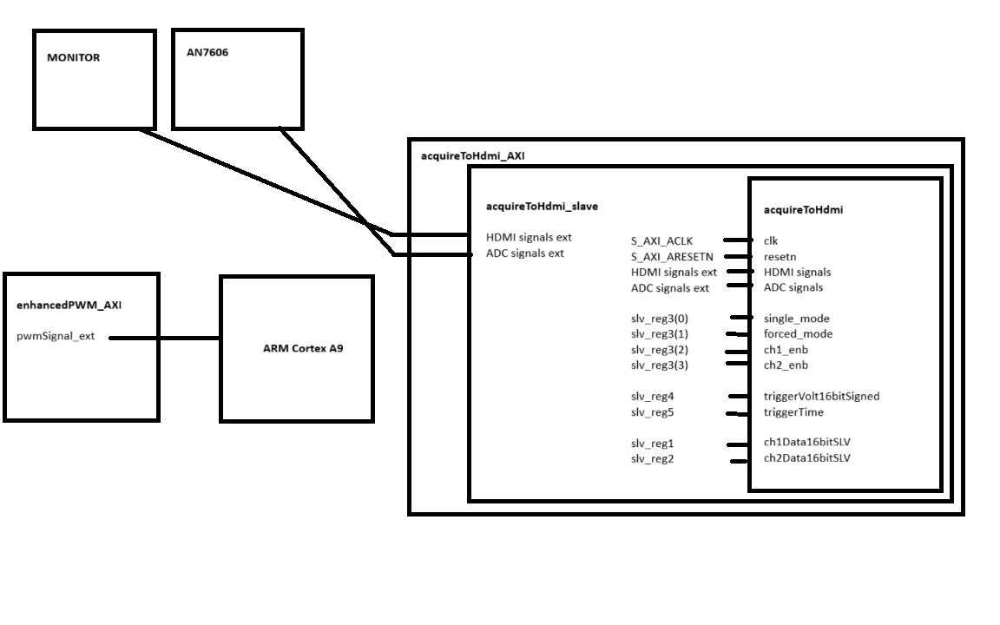

## Overview

For this project, I designed a two-channel oscilloscope on a Xilinx Zynq-7010 SoC. The design captures analog signals from the AD7606 ADC and displays the waveforms in real time over HDMI. The design splits responsibility across two domains on the same chip: programmable logic (PL) which is implemented in VHDL, handles the acquisition and video pipeline which is very timing-dependent, while the ARM Cortex-A9 processing system (PS) runs embedded C firmware for user control through a command line interface.

The two domains communicate through a custom AXI4-Lite slave peripheral, giving the ARM processor memory-mapped access to control registers, status flags, and live sample data in the FPGA fabric.


<div style="width: 500px; margin: 0 auto; text-align: center;">


</div>

---

## System Architecture

The top-level VHDL entity `acquireToHDMI.vhdl` is packaged in an IP named `final_oscope` and instantiates a datapath (`acquireToHDMI_datapath.vhdl`) handling the ADC interface, waveform buffering, and video rendering. The datapath uses the submodules `videoSignalGenerator.vhdl` to generate the HDMI signals and `scopeFace` to assign the correct RBG values to each coordiate to display the oscilloscope interface. Furthermore, a Moore FSM (`acquireToHDMI_fsm.vhdl`) generating the control word that sequences all operations. In addition, the module `scopeToHdmi.vhdl` The AXI wrapper (`final_oscope_slave_lite_v1_0_S00_AXI.vhdl`) instantiates this top-level and exposes its ports as memory-mapped registers to the PS. The signals fed from the wrapper were accessed in the file `helloworld.c`. For function generation, the enhancedPwm IP is used which takes in a duty cycle and outputs the pwm signal.

```
  +---------------------+        AXI4-Lite Bus        +----------------------+
  |  ARM Cortex-A9 (PS) | <-------------------------> |   PL (VHDL Fabric)   |
  |                     |                             |                      |
  |  Vitis C firmware   |   slv_reg0: CH1 data (R)    |  final_oscope        |
  |  - UART CLI         |   slv_reg1: CH2 data (R)    |  +-----------------+ |
  |  - TTC0 ISR         |   slv_reg2: status (R)      |  | ADC FSM         | |
  |  - Trigger control  |   slv_reg3: control (W)     |  | Sample timer    | |
  |  - Function gen     |   slv_reg4: trig volt (W)   |  | Trigger logic   | |
  |                     |   slv_reg5: trig time (W)   |  | HDMI renderer   | |
  +---------------------+                             |  +-----------------+ |
                                                      |                      |
                                        AD7606 ADC -->|  16-bit parallel bus |
                                        HDMI output <-|  TMDS serializer     |
                                                      +----------------------+
```
```
  +---------------------+        AXI4-Lite Bus        +----------------------+
  |  ARM Cortex-A9 (PS) | <-------------------------> |   PL (VHDL Fabric)   |
  |                     |                             |                      |
  |  Vitis C firmware   |                             |  final_oscope        |
  |  - UART CLI         |   slv_reg0: CH1 data (R)    |  +-----------------+ |
  |  - TTC0 ISR         |   slv_reg1: CH2 data (R)    |  | ADC FSM         | |
  |  - Trigger control  |   slv_reg2: status (R)      |  | Sample timer    | |
  |  - Function gen     |   slv_reg3: control (W)     |  | Trigger logic   | |
  |                     |   slv_reg4: trig volt (W)   |  | HDMI renderer   | |
  +---------------------+   slv_reg5: trig time (W)   |  +-----------------+ |
                            slv_reg6+: unused         |          |           |
                                                      |          |           |
                                                      |   BRAM waveform      |
                                                      |          |           |
                                                      |          v           |
                                                      |  +----------------+  |
                                                      |  | enhancedPwm    |  |
                                                      |  | (AXI wrapper)  |  |
                                                      |  |                |  |
                                                      |  | dutyCycle <-   |  |
                                                      |  |   BRAM sample  |  |
                                                      |  | pwmCounter     |  |
                                                      |  | PWM output     |  |
                                                      |  +----------------+  |
                                                      |          |           |
                                                      |          v           |
                                                      |     PWM waveform     |
                                                      |   (RC / filter out)  |
                                                      |                      |
                                        AD7606 ADC -->|  16-bit parallel bus |
                                        HDMI output <-|  TMDS serializer     |
                                                      +----------------------+
```
---

## Programmable Logic — VHDL Design

### Datapath and Control

The PL follows a standard datapath and control design. The datapath (`acquireToHDMI_datapath.vhdl`) contains all registers, counters, BRAMs, comparators, and pixel converters as structural VHDL instantiations. The control module (`acquireToHDMI_fsm.vhdl`) is a finite state machine that observes the status word (`sw`) from the datapath and drives a control word (`cw`) back to it — the two modules communicate only through these two buses, with no direct logic between them. The datapath additionally manages the TMDS signals required for HDMI display.

```vhdl
entity acquireToHDMI_datapath is
    PORT ( clk : in  STD_LOGIC;
        resetn : in  STD_LOGIC;
        cw : in STD_LOGIC_VECTOR(CW_WIDTH -1 downto 0);
        sw : out STD_LOGIC_VECTOR(DATAPATH_SW_WIDTH - 1 downto 0);
        an7606data: in STD_LOGIC_VECTOR(15 downto 0);

        triggerVolt16bitSigned: in SIGNED(15 downto 0);
        triggerTimePixel: in STD_LOGIC_VECTOR(VIDEO_WIDTH_IN_BITS-1 downto 0);
        ch1Data16bitSLV, ch2Data16bitSLV: out STD_LOGIC_VECTOR(15 downto 0);
        
        ch1enb, ch2enb : in std_logic;
        
        tmdsDataP : out  STD_LOGIC_VECTOR (2 downto 0);
        tmdsDataN : out  STD_LOGIC_VECTOR (2 downto 0);
        tmdsClkP : out STD_LOGIC;
        tmdsClkN : out STD_LOGIC;
        hdmiOen:    out STD_LOGIC;
        
        sampleRate_ctrl : in STD_LOGIC_VECTOR(1 downto 0)
    );
end acquireToHDMI_datapath;
```

### CW and SW Signals

The FSM has no knowledge of signal values — it only sees a vector of condition bits (the status word) and outputs a vector of control bits (the control word). Every datapath resource — counters, registers, BRAM write enables — is gated by a dedicated bit in `cw`. This makes the state outputs in the FSM completely readable as a lookup table: each state drives a fixed `cw` pattern with named bit positions defined in the shared package.

**Key status word (sw) bits observed by the FSM:**

| Bit | Signal | Source in datapath |
|---|---|---|
| `BUSY_SW` | AD7606 busy pin | External ADC pin |
| `SHORT_DELAY_DONE_SW` | Short counter == target | `shortCompare` |
| `LONG_DELAY_DONE_SW` | Long counter == target | `longCompare` |
| `FULL_SW` | BRAM write address == screen width | `cmp_BRAM_full` |
| `SAMPLE_SW` | Sample counter == rate target | `sampleCompare` |
| `TRIG_CH1_SW` | CH1 rising edge detected | Trigger comparators |
| `TRIG_CH2_SW` | CH2 rising edge detected | Trigger comparators |
| `STORE_SW` | SR latch — BRAM fill active | SR latch process |
| `SINGLE_SW` / `FORCED_SW` | Mode from PS control reg | user input (AXI slv_reg3) |

**Key control word (cw) bits driven by the FSM:**

| Bit(s) | Function |
|---|---|
| `CONVST_CW` | Assert ADC conversion start |
| `CS_CW`, `RD_CW` | ADC chip select and read strobe |
| `RESET_AD7606_CW` | ADC hardware reset |
| `DATA_STORAGE_CH1_WRITE_CW` | BRAM write enable for CH1 |
| `DATA_STORAGE_CH2_WRITE_CW` | BRAM write enable for CH2 |
| `TRIG_CH1_WRITE_CW` | Load trigger sample register CH1 |
| `TRIG_CH2_WRITE_CW` | Load trigger sample register CH2 |
| `SET_STORE_FLAG_CW` / `CLEAR_STORE_FLAG_CW` | Set/clear the SR latch |
| `DATA_STORAGE_COUNTER_CW` | Count/hold/reset BRAM write address |
| `SHORT_DELAY_COUNTER_CW` / `LONG_DELAY_COUNTER_CW` | Count/hold/reset delay timers |
| `SAMPLING_COUNTER_CW` | Count/hold/reset sample interval timer |

### Finite State Machine Implementation

The FSM has 22 states sequencing the full acquisition pipeline. The major flow is:


At each ADC read state, the FSM branches based on `STORE_SW`: if the SR latch is set (BRAM fill is active), it routes the sample to BRAM (`WRITE_CH1_BRAM`); otherwise it routes it only to the trigger comparator registers (`WRITE_CH1_TRIG`). This ensures samples are compared against the threshold continuously but only written to BRAM once a trigger has been detected.

### ADC Interface (AD7606)

The ALINX daughter board AN706, contains an Analog Devices AD7606 8-channel 16-bit ADC which was used to digitize the analog input. The AD7606 uses a successive approximation register (SAR) approach. The converter accepts analog input voltages in the range of -5 V to +5 V and produces a signed 16-bit two's-complement output value; it also supports sampling rates up to 200 kS/s and presents the conversion result through a parallel digital interface. 

The FSM drives the external ADC signals `CONVST`, `CS`, `RD`, and `RESET` in the correct sequence, asserting conversion start, waiting for the `BUSY` flag to deassert (states `BUSY_0` -> `BUSY_1`), then clocking out the 16-bit result. Two short-delay counters in the datapath provide the required ADC setup and hold timing. Sampling rate is controlled by a 4-to-1 mux (`sampleMux`) that selects between four preset counter targets based on the 2-bit `sampleRate_select` from the PS.

### Trigger Logic

Trigger detection uses a two-sample edge detector implemented structurally in the datapath. For each channel, two chained `genericRegister` instances capture consecutive ADC samples, and two `genericCompare_Signed` instances compare each against the signed threshold voltage:

- **Sample 1 comparator:** checks `sample1 > threshold` (rising condition)
- **Sample 2 comparator:** checks `sample2 < threshold` (pre-crossing condition)

The trigger fires when both conditions are true simultaneously — sample 2 was below threshold and sample 1 crossed above it. This detects a rising edge crossing rather than just a level threshold, preventing false triggers on a flat signal sitting above the threshold.

**Trigger mode** (`forced_mode = 0`) — the FSM loops through `BEGIN_CONVST` continuously, writing samples only to the trigger registers, until `TRIG_CH1_SW` fires. Then `SET_STORE_FLAG` enables BRAM writes and the next `VIDEO_WIDTH` samples fill the display buffer.

**Forced mode** (`forced_mode = 1`) — the FSM parks in `WAIT_FORCED` and only proceeds on a `SINGLE_SW` pulse from the PS, immediately setting the store flag and capturing one frame.

### HDMI Video Output and Waveform Rendering

The datapath instantiates a `clk_wiz_0` PLL to derive the pixel clock (`videoClk`) and a 5x clock (`videoClk5x`) for TMDS serialization from the system clock. In addition, video control was implemented to convert VGA to HDMI format. The control logic was responsible for displaying the grid, two trigger markers, and the two channel waveforms. The submodule `videoSignalGenerator.vhdl` produces standard `HS`, `VS`, and `DE` timing signals along with pixel coordinates (`pixelHorz`, `pixelVert`).
:

```vhdl
entity videoSignalGenerator is
    PORT(	
        clk: in  STD_LOGIC;
        resetn : in  STD_LOGIC;
        hs: out STD_LOGIC;
        vs: out STD_LOGIC;
        de: out STD_LOGIC;
        pixelHorz: out STD_LOGIC_VECTOR(VIDEO_WIDTH_IN_BITS - 1 downto 0);
        pixelVert: out STD_LOGIC_VECTOR(VIDEO_WIDTH_IN_BITS - 1 downto 0));
end videoSignalGenerator;
```

The submodule `scopeFace.vhdl` determines the appropriate RGB values at each pixel location. These RGB values are dependent on the type of item being drawn.

```vhdl
entity scopeFace is
    PORT ( 	clk: in  STD_LOGIC;
        resetn : in  STD_LOGIC;
        pixelHorz : in  STD_LOGIC_VECTOR(VIDEO_WIDTH_IN_BITS - 1 downto 0);
        pixelVert : in  STD_LOGIC_VECTOR(VIDEO_WIDTH_IN_BITS -1 downto 0);
        triggerVolt: in STD_LOGIC_VECTOR (VIDEO_WIDTH_IN_BITS - 1 downto 0);
        triggerTime: in STD_LOGIC_VECTOR (VIDEO_WIDTH_IN_BITS - 1 downto 0);
        red : out  STD_LOGIC_VECTOR(7 downto 0);
        green : out  STD_LOGIC_VECTOR(7 downto 0);
        blue : out  STD_LOGIC_VECTOR(7 downto 0);
        ch1: in STD_LOGIC;
        ch1Enb: in STD_LOGIC;
        ch2: in STD_LOGIC;
        ch2Enb: in STD_LOGIC);
end scopeFace;
```
In the `scopeToHdmi_package.vhdl`, the RGB values for each region of the display are declared as constants:

```vhdl
	-- Display border - white
    constant BORDER_R : STD_LOGIC_VECTOR(7 downto 0) := X"FF";
    constant BORDER_G : STD_LOGIC_VECTOR(7 downto 0) := X"FF";
    constant BORDER_B : STD_LOGIC_VECTOR(7 downto 0) := X"FF";

    -- Grid, tickmarks, and major axes - gray
    constant GRID_R : STD_LOGIC_VECTOR(7 downto 0) := X"40";
    constant GRID_G : STD_LOGIC_VECTOR(7 downto 0) := X"40";
    constant GRID_B : STD_LOGIC_VECTOR(7 downto 0) := X"40";

    -- Channel 1 - yellow
    constant CH1_R : STD_LOGIC_VECTOR(7 downto 0) := X"FD";
    constant CH1_G : STD_LOGIC_VECTOR(7 downto 0) := X"FF";
    constant CH1_B : STD_LOGIC_VECTOR(7 downto 0) := X"00";

    -- Channel 2 - green
    constant CH2_R : STD_LOGIC_VECTOR(7 downto 0) := X"00";
    constant CH2_G : STD_LOGIC_VECTOR(7 downto 0) := X"FF";
    constant CH2_B : STD_LOGIC_VECTOR(7 downto 0) := X"1C";

    -- Trigger Arrows - cyan
    constant TRIGGER_R : STD_LOGIC_VECTOR(7 downto 0) := X"00";
    constant TRIGGER_G : STD_LOGIC_VECTOR(7 downto 0) := X"FF";
    constant TRIGGER_B : STD_LOGIC_VECTOR(7 downto 0) := X"FF";
```

Each channel's BRAM is dual-port: port A is clocked on the system clock and written by the FSM during acquisition; port B is clocked on the pixel clock and read during display. The read address is `pixelHorz - L_EDGE`, mapping each horizontal pixel directly to a stored sample. A `toPixelValue` converter scales the 16-bit signed ADC value to a vertical pixel coordinate, and a `genericCompare` checks whether the current `pixelVert` matches — driving the `ch1` / `ch2` signals into the `scopeFace` renderer which composites the waveform, grid, and trigger markers into RGB pixel values for the `hdmi_tx_0` serializer.

The logic of the datapath which includes the hdmi display with BRAM waveform rendering can be seen in the block diagram below:


The final result is an IP that displays channel data from the ADC to a standard oscilloscope HDMI display using datapath and control design logic. The following image shows the display when both channels are connected to an external function generator:

<div style="width: 600px; margin: 0 auto; text-align: center;">


</div>

However, to complete the design, a seperate IP had to be created for custom function generation.

### PWM Function Generation IP

A seperate enhancedPwm IP was created to add waveform generation functionality using pulse width modulation (PWM). The module `enhancedPwm.vhdl` contains the PL functionality for generating a pwm signal for function generation. 

```vhdl
entity enhancedPwm is
    Port ( clk : in STD_LOGIC;
        resetn : in STD_LOGIC;
        dutyCycle : in STD_LOGIC_VECTOR (8 downto 0);
        enb : in STD_LOGIC;
        pwmSignal : out STD_LOGIC;
        pwmCount : out STD_LOGIC_VECTOR (7 downto 0);
        rollOver : out STD_LOGIC);
end enhancedPwm;
```

The module contains an 8-bit free-running counter `pwmCount` that repeatedly counts from 0 to 255. A comparator continuously compares the current counter value to the 9-bit `duty_cycle` input. The PWM output goes high when the duty cycle value is greater than the counter value, producing a pulse train whose duty cycle is proportional to the input sample value.

The `enhancedPwm` IP is integrated with the `final_oscope` IP by using the waveform samples stored in BRAM as the duty cycle input. The waveform samples are read sequentially from memory and supplied to the PWM module. Each stored sample determines the duty cycle for one PWM period, generating a wave with sharp jumps between samples. Because of this, a low pass filter is applied and the PWM signal is reconstructed into a continuous analog voltage waveform.

This allows the captured ADC data to be stored in memory, displayed on the HDMI oscilloscope interface, and sent through the PWM output using the same sample buffer. The PL implements both waveform acquisition and waveform generation using a common BRAM-based data path.


### AXI4-Lite Slave Wrapper

The AXI wrapper (`final_oscope_slave_lite_v1_0_S00_AXI`) implements a custom AXI4-Lite slave with 10 32-bit registers and two independent read/write state machines. The register map exposes the oscilloscope IP to the ARM:

| Register | Direction | Contents |
|---|---|---|
| slv_reg0 | Read | CH1 sample data (16-bit) |
| slv_reg1 | Read | CH2 sample data (16-bit) |
| slv_reg2 | Read | Status flags |
| slv_reg3 | Write | Control register |
| slv_reg4 | Write | Trigger voltage (signed 16-bit) |
| slv_reg5 | Write | Trigger time (pixel position) |

```vhdl
S_AXI_RDATA <= ch1_data_int when (axi_araddr(ADDR_LSB+OPT_MEM_ADDR_BITS downto ADDR_LSB) = "000" ) else
ch2_data_int when (axi_araddr(ADDR_LSB+OPT_MEM_ADDR_BITS downto ADDR_LSB) = "0001" ) else
status_reg_int when (axi_araddr(ADDR_LSB+OPT_MEM_ADDR_BITS downto ADDR_LSB) = "0010" ) else
slv_reg3 when (axi_araddr(ADDR_LSB+OPT_MEM_ADDR_BITS downto ADDR_LSB) = "0011" ) else -- control register
slv_reg4 when (axi_araddr(ADDR_LSB+OPT_MEM_ADDR_BITS downto ADDR_LSB) = "0100" ) else -- trigger voltage
slv_reg5 when (axi_araddr(ADDR_LSB+OPT_MEM_ADDR_BITS downto ADDR_LSB) = "0101" ) else -- trigger time
slv_reg6 when (axi_araddr(ADDR_LSB+OPT_MEM_ADDR_BITS downto ADDR_LSB) = "0110" ) else
slv_reg7 when (axi_araddr(ADDR_LSB+OPT_MEM_ADDR_BITS downto ADDR_LSB) = "0111" ) else
slv_reg8 when (axi_araddr(ADDR_LSB+OPT_MEM_ADDR_BITS downto ADDR_LSB) = "1000" ) else
slv_reg9 when (axi_araddr(ADDR_LSB+OPT_MEM_ADDR_BITS downto ADDR_LSB) = "1001" ) else
(others => '0');
```

```vhdl
component acquireToHdmi is
PORT ( clk : in  STD_LOGIC;
    resetn : in  STD_LOGIC;

    flag_clear : in STD_LOGIC; -- control reg 3
    flag_q : out STD_LOGIC; -- status reg 2

    single_mode : in  STD_LOGIC; -- control reg 3
    forced_mode : in  STD_LOGIC; -- control reg 3
    ch1enb, ch2enb : in STD_LOGIC; -- control reg 3
    sampleRate_select : in STD_LOGIC_VECTOR(1 downto 0); -- control reg 3

    triggerCh1, triggerCh2: out STD_LOGIC; -- status reg 2
    conversionPlusReadoutTime: out STD_LOGIC; -- status reg 2
    sampleTimerRollover: out STD_LOGIC; -- status reg 2

    an7606data: in STD_LOGIC_VECTOR(15 downto 0);
    an7606convst, an7606cs, an7606rd, an7606reset: out STD_LOGIC;
    an7606od: out STD_LOGIC_VECTOR(2 downto 0);
    an7606busy : in STD_LOGIC;

    tmdsDataP : out  STD_LOGIC_VECTOR (2 downto 0);
    tmdsDataN : out  STD_LOGIC_VECTOR (2 downto 0);
    tmdsClkP : out STD_LOGIC;
    tmdsClkN : out STD_LOGIC;
    hdmiOen:    out STD_LOGIC;

    triggerVolt16bitSigned: in SIGNED(15 downto 0); -- reg4
    triggerTime: in STD_LOGIC_VECTOR(VIDEO_WIDTH_IN_BITS-1 downto 0); -- reg5
    ch1Data16bitSLV, ch2Data16bitSLV: out STD_LOGIC_VECTOR(15 downto 0)
  );
end component;
signal ch1_data_int : std_logic_vector(C_S_AXI_DATA_WIDTH-1 downto 0); -- read reg 0
signal ch2_data_int : std_logic_vector(C_S_AXI_DATA_WIDTH-1 downto 0); -- read reg 1
signal status_reg_int : std_logic_vector(C_S_AXI_DATA_WIDTH-1 downto 0); -- read reg 2
```

```vhdl
oscope_inst : acquireToHdmi
PORT MAP(
    clk => S_AXI_ACLK,
    resetn => S_AXI_ARESETN,
    flag_clear => slv_reg3(7),
    flag_q => status_reg_int(4),
    single_mode => slv_reg3(0),
    forced_mode => slv_reg3(1),
    ch1enb => slv_reg3(2),
    ch2enb => slv_reg3(3),
    sampleRate_select => slv_reg3(5 downto 4),
    
    triggerCh1 => status_reg_int(0),
    triggerCh2 => status_reg_int(1),
    conversionPlusReadoutTime => status_reg_int(2),
    sampleTimerRollover => status_reg_int(3),
    
    an7606data => an7606data_ext,
    an7606convst => an7606convst_ext,
    an7606cs => an7606cs_ext,
    an7606rd => an7606rd_ext,
    an7606reset => an7606reset_ext,
    an7606od => an7606od_ext,
    an7606busy => an7606busy_ext,
    
    tmdsDataP => tmdsDataP_ext,
    tmdsDataN => tmdsDataN_ext,
    tmdsClkP => tmdsClkP_ext,
    tmdsClkN => tmdsClkN_ext,
    hdmiOen => hdmiOen_ext,
    
    triggerVolt16bitSigned => signed(slv_reg4(15 downto 0)),
    triggerTime => slv_reg5(VIDEO_WIDTH_IN_BITS-1 downto 0),
    ch1Data16bitSLV => ch1_data_int(15 downto 0),
    ch2Data16bitSLV => ch2_data_int(15 downto 0)
);  
```

**Control register (slv_reg3) bit map:**

| Bit | Function |
|---|---|
| 0 | `single_mode` — pulse to acquire one frame |
| 1 | `forced_mode` — run continuously without trigger |
| 2 | `ch1enb` — enable channel 1 |
| 3 | `ch2enb` — enable channel 2 |
| 5:4 | `sampleRate_select` — 2-bit sample rate |
| 6 | Reset pulse (not used) |
| 7 | Flag clear — acknowledge sample-ready flag |

**Status register (slv_reg2) bit map:**

| Bit | Function |
|---|---|
| 0 | `triggerCh1` — CH1 threshold crossed |
| 1 | `triggerCh2` — CH2 threshold crossed |
| 2 | `conversionPlusReadoutTime` — ADC busy window |
| 3 | `sampleTimerRollover` — sample period elapsed |
| 4 | `flag_q` — new sample ready flag |

---

The wrapper `final_oscope_slave_lite_v1_0_S00_AXI` was used to create the `final_oscope_0` IP with the appropriate signal inputs and outputs. This was combined with the `enhancedPwm_AXI` IP and the processing unit, to create the final vivado design block diagram seen below:


## Embedded Software — ARM Cortex-A9 (C)

Once the memory mapping of the signals was decided, vitis accesses these registers in C. The firmware runs on the PS under Xilinx Vitis (bare-metal, no OS) and provides a UART command-line interface for real-time oscilloscope control. The C code accesses the read and write registers passed through by the AXI wrapper.

### Function Generator with TTC0 Timer ISR and Direct Digital Synthesis

A Triple Timer Counter (TTC0) is configured to fire at 10 kHz. On each interrupt, the ISR steps a 16-bit phase accumulator by a configurable `phaseIncrement` and indexes a 64-entry LUT to produce the next DAC output value via an enhanced PWM peripheral. The user is able to choose the generation of either a sine or sinc function. Each is represented by a 64-point quantized sine LUT.

Output frequency is set by entering a value in Hz over UART; the firmware computes the correct phase increment using a pre-characterized linear regression (`phaseIncrement = 6.5516 * frequency + 0.0062`).

### UART Command Interface

The main loop blocks on `XUartPs_RecvByte()` and dispatches on a single character:

| Key | Action |
|---|---|
| `t` | Toggle trigger / forced acquisition mode |
| `n` | Single-shot acquire (pulse `single_mode` bit high then low) |
| `+` / `-` | Increment / decrement trigger voltage by 1000 LSB |
| `v` | Reset trigger voltage to 0 |
| `a` / `b` | Toggle CH1 / CH2 enable |
| `s` | Toggle function generator on/off |
| `w` | Select sine or sinc waveform |
| `d` | Set PWM duty cycle manually |
| `u` | Read and print 64 sequential samples from CH1 |
| `r` | Universal reset (pulse reset bit in control register) |
| `?` | Print help menu |

### Register Access Pattern

All PS↔PL communication goes through the AXI register map using the generated `FINAL_OSCOPE_mReadReg` / `FINAL_OSCOPE_mWriteReg` macros. A typical read-modify-write on the control register looks like:

```c
// Toggle forced mode bit
u32 reg = FINAL_OSCOPE_mReadReg(XPAR_FINAL_OSCOPE_0_BASEADDR,
                                 FINAL_OSCOPE_S00_AXI_SLV_REG3_OFFSET);
reg ^= (1 << 1);  // flip forced_mode bit
FINAL_OSCOPE_mWriteReg(XPAR_FINAL_OSCOPE_0_BASEADDR,
                        FINAL_OSCOPE_S00_AXI_SLV_REG3_OFFSET, reg);
```

The trigger voltage is stored as a signed 16-bit value in the lower half of a 32-bit register, requiring a careful mask-and-cast on both read and write to preserve the upper 16 bits and handle two's complement correctly:

```c
// Read signed 16-bit trigger voltage
u32 full = FINAL_OSCOPE_mReadReg(BASEADDR, REG4_OFFSET);
int16_t voltage = (int16_t)(full & 0xFFFF);
voltage += 1000;
FINAL_OSCOPE_mWriteReg(BASEADDR, REG4_OFFSET,
    (full & 0xFFFF0000) | ((u32)voltage & 0xFFFF));
```

---

## Key Design Decisions

**Splitting acquisition and rendering into PL.** Doing the ADC sequencing and HDMI pixel rendering in VHDL keeps all hard real-time operations in the fabric and away from the ARM. The PS only needs to write configuration registers and poll status — it never has to meet a pixel clock deadline.

**AXI flag handshake for sample-ready.** Rather than polling the ADC busy signal directly from software, the PL sets a `flag_q` bit in the status register when a new sample is ready, and the PS acknowledges it by pulsing `flag_clear`. This decouples the ADC conversion timing from the software polling rate and avoids missed samples.

**Signed trigger voltage over AXI.** The AD7606 outputs signed 16-bit values, so the trigger threshold needs to be signed too. Passing it through a 32-bit AXI register required explicit masking to avoid sign extension corrupting the upper half of the register — a subtle bug that showed up during integration testing.

**Phase accumulator for waveform generation.** Instead of computing sine values in the ISR (too slow for bare-metal at 10 kHz), the ISR uses a 16-bit phase accumulator and a pre-computed 64-entry LUT. The upper 6 bits of the accumulator index into the table, giving smooth frequency control by just changing the increment value.

---



## Tools Used

- **Xilinx Vivado** — VHDL synthesis, implementation, AXI IP packaging
- **Xilinx Vitis** — ARM Cortex-A9 bare-metal C firmware
- **ModelSim** — VHDL functional simulation
- **Zynq-7010 SoC** (Digilent board) — target hardware

[View on GitHub →](https://github.com/scast3/oscilloscope)