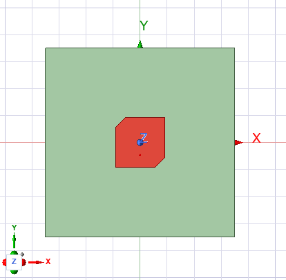
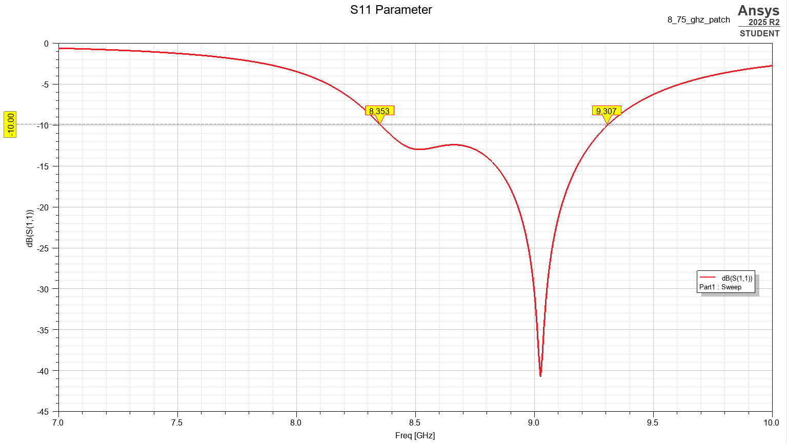
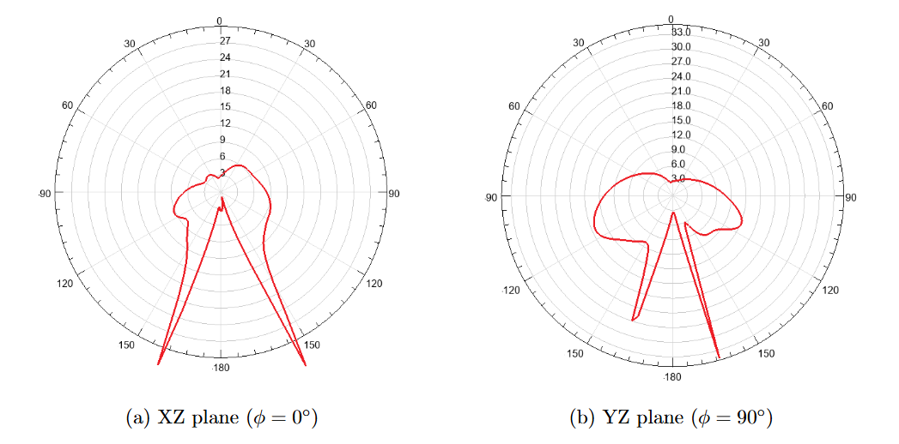
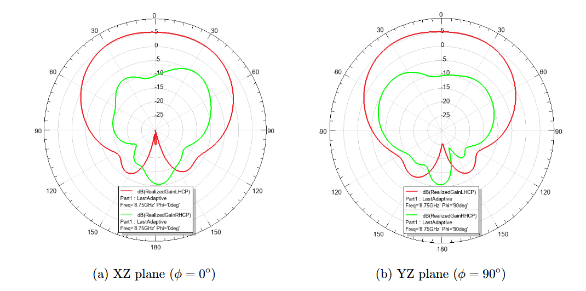
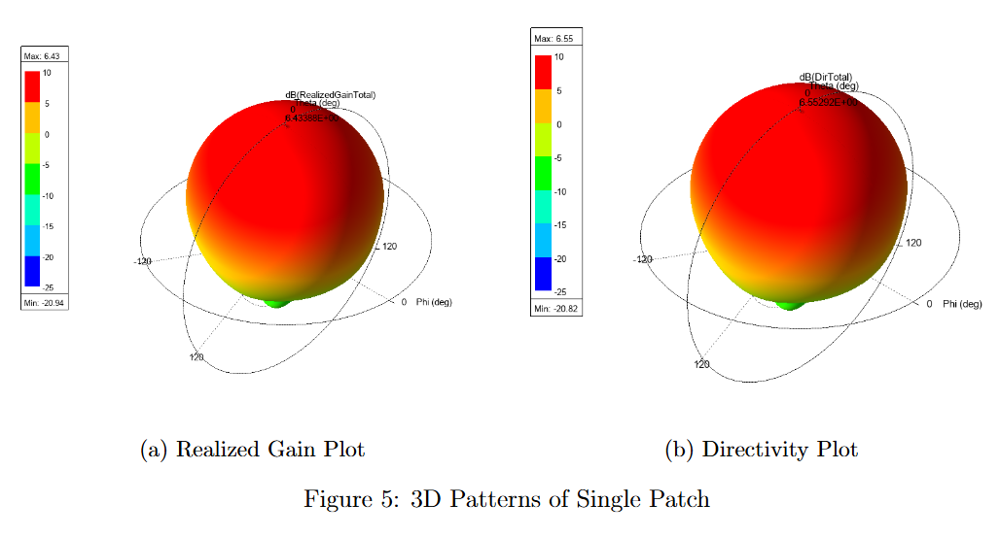
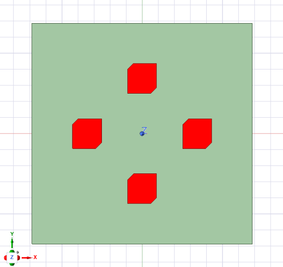
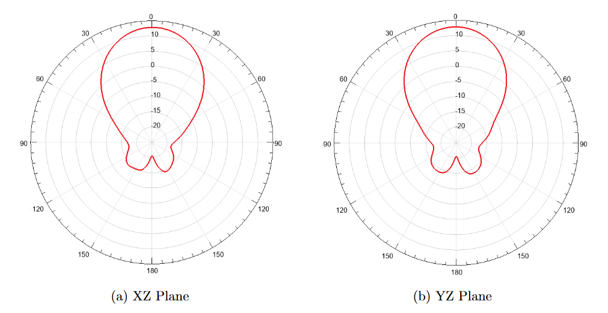
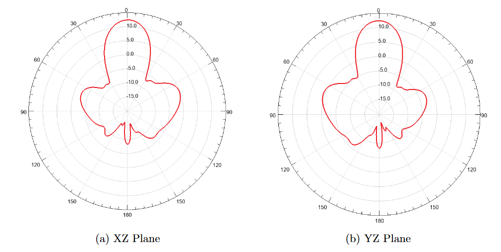
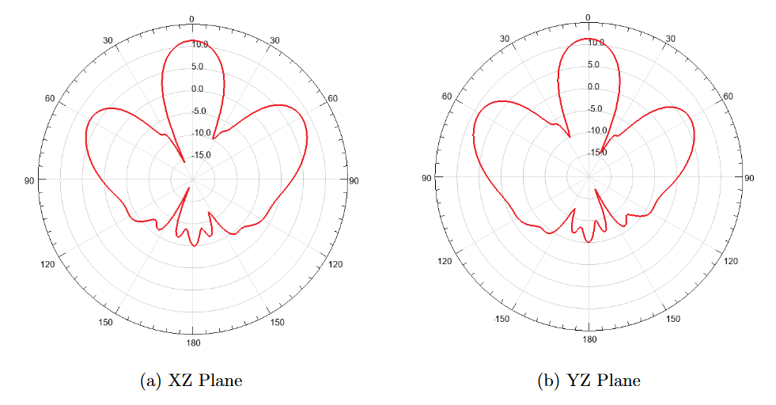

## Overview

This project was the design, simulation, and analysis of a circularly polarized (CP) microstrip patch antenna operating at a center frequency of 8.75 GHz, along with a 4-element array configuration.

Circular polarization is achieved through a corner-chamfered patch fed by a coaxial probe beneath the ground plane offset from the edge. The single element design is first validated against all specifications before a 4-element array is investigated at element spacings of $0.5\lambda$, $0.75\lambda$, and $\lambda$ to evaluate mutual coupling and radiation performance. All simulations were performed in Ansys HFSS.

**Design targets:**

| Parameter | Requirement |
|---|---|
| Center frequency | 8.75 GHz |
| Bandwidth (S11 < -10 dB) | 8.5 – 9.0 GHz |
| Axial ratio at broadside | < 3 dB |
| RHCP/LHCP gain difference | ≥ 15 dB |

---

## Antenna Design

 In this design, a Rogers RO3003 substrate was used with a relative permittivity of $\varepsilon_r = 3.0$ and a thickness of $h = 1.52$ mm.

### Patch Dimensions

Before simulation, the theoretical dimensions for the patch antenna were calculated using closed-form design equations. In this design, a Rogers RO3003 substrate was used with a relative permittivity of $\varepsilon_r = 3.0$ and a thickness of $h = 1.52$ mm.

A square patch geometry is required to support the two orthogonal modes needed for circular polarization. The effective dielectric constant and fringing field extension were calculated analytically, giving a starting patch size of 9.11 × 9.11 mm. 

The coaxial feed offset for a 50 Ω match was estimated at $y_0 \approx$ 2.84 mm from the edge.

### Circular Polarization via Corner Chamfer

To achieve circular polarization using a single probe feed, two opposite corners of the square patch are truncated by a length $dL$. The truncation length is related to the quality factor $Q_0$:

$$
dL = L \sqrt{\frac{1}{2 Q_0}}
$$

For the RO3003 substrate at 8.75 GHz, an estimated quality factor of $Q_0 \approx 40$ yields a truncation length of $dL \approx 1.02$ mm. This perturbation splits the fundamental mode into two orthogonal modes with the required 90° phase shift for circular polarization.

### Final Optimized Parameters

In HFSS, the dimensions derived from the equations were modified to meet the desired specification of the antennas. The final parameters were obtained through a combination of parametric sweeps and optimization runs.

| Parameter | Value |
|---|---|
| Substrate | Rogers RO3003 |
| Relative permittivity | 3.0 |
| Loss tangent | 0.0013 |
| Substrate thickness | 0.508 mm |
| Substrate / ground size | 35 × 35 mm |
| Patch width W | 9.00 mm |
| Patch length L | 9.25 mm |
| Chamfer cut dL | 1.8 mm |
| Feed offset y₀ | 2.3 mm |

The final patch after optimization is slightly nonsquare (9.00 × 9.25 mm) to simultaneously satisfy bandwidth and axial ratio requirements.

<div style="width: 500px; margin: 0 auto; text-align: center;">



</div>

---

## Single Element Simulation Results

### S11 — Impedance Bandwidth

Two resonant dips appear at approximately 8.5 GHz and 9.0 GHz, corresponding to the two orthogonal modes introduced by the chamfer. Both remain below -10 dB, yielding a simulated bandwidth of 8.353 – 9.307 GHz (10.8%), comfortably exceeding the 8.5 – 9.0 GHz requirement.




### Axial Ratio

At broadside (θ = 0°), an axial ratio of 2.89 dB was achieved at 8.75 GHz, confirming good circular polarization quality just under the 3 dB requirement.



### Polarization Performance

The RHCP realized gain exceeds the LHCP gain by **15.68 dB** at broadside, meeting the ≥ 15 dB isolation requirement. The patch radiates left-hand circular polarization (LHCP).



### Gain and Directivity



| Parameter | Value |
|---|---|
| Maximum realized gain | 6.43 dBic |
| Maximum directivity | 6.55 dBi |

### Performance vs. Requirements

| Parameter | Requirement | Simulated | Met? |
|---|---|---|---|
| Center frequency | 8.75 GHz | 8.83 GHz | Yes |
| Bandwidth | 8.5 – 9.0 GHz | 8.353 – 9.307 GHz | Yes |
| Axial ratio | < 3 dB | 2.89 dB | Yes |
| RHCP/LHCP difference | ≥ 15 dB | 15.68 dB | Yes |

---

## 4-Element Circular Array

### Configuration

Four single elements were arranged in a circular array and independently fed with equal amplitude and phase. The array radius was evaluated at three spacings relative to the free-space wavelength at 8.75 GHz (λ ≈ 34.3 mm):



| Configuration | Spacing | Radius |
|---|---|---|
| Config 1 | 0.5λ | 17.15 mm |
| Config 2 | 0.75λ | 25.73 mm |
| Config 3 | 1.0λ | 34.30 mm |

### Mutual Coupling

S-parameter analysis was performed for both single-port excitation (passive) and all-port excitation (active) at each spacing. Across all three configurations, coupling between elements (S21, S31) remained consistently below -20 dB, indicating minimal mutual coupling. With all four ports active, each element maintained its impedance bandwidth within specification.

### Radiation Pattern Calculation

Array patterns were computed using pattern multiplication in MATLAB — the single-element HFSS gain pattern (converted to linear scale) was combined with the analytically derived array factor for a circular array:

```
AF(theta, phi) = sum over n of exp(j*k*(x_n*sin(theta)*cos(phi) + y_n*sin(theta)*sin(phi)))
```

MATLAB results were compared against HFSS full-array simulations and showed good agreement across all three spacings.







### Array Observations

- The 0.5λ configuration produced the highest total realized gain with wide, clean main beam and low sidelobes
- The 0.75λ and 1.0λ configurations produced narrower main beams but with significantly larger sidelobes
- No grating lobes were observed at 0.5λ spacing; sidelobe performance degraded at larger radii as expected

---

## Fabrication and Measurement

The single-element antenna was milled from Rogers RO3003 substrate using a **Bantam Tools Desktop CNC PCB Mill**. A coaxial probe feed was implemented with an SMA connector soldered through the ground plane to the patch.

The fabricated antenna was measured using an **R140 1-port VNA**. The measured S11 showed a clear resonance at approximately 9.3 GHz — higher than the simulated 8.75 GHz. 

### Diagnosing the Frequency Shift

A parametric HFSS sweep over εr was conducted to identify the true substrate permittivity. Shifting εr from 3.0 to **2.85** moved the upper resonant dip to 9.3 GHz, matching the measured result. The slight permittivity variation is consistent with typical manufacturing tolerances in Rogers substrates.

Additional fabrication factors that likely contributed to the shift:
- CNC milling tolerances on patch edge dimensions
- SMA connector required physical modification; connector body required clearance from the ground plane to avoid shorting

---

## Key Takeaways

**On CP design:** The chamfer size dL simultaneously controls axial ratio and S11 dip separation — they are not independent parameters. Increasing dL improves axial ratio but spreads the two resonant dips apart, risking a mid-band peak. Finding the right dL is a direct tradeoff between CP quality and impedance bandwidth, which simulation makes much clearer than equations alone.

**On HFSS optimization:** When Optimetrics wouldn't converge, understanding the behavior of gradient-based vs. pattern search algorithms and choosing appropriate parameter starting points was critical. Cost function weighting on axial ratio vs. S11 helped guide the optimizer to a useful solution.

**On fabrication:** Exporting to Gerber for the Bantam mill required careful attention to layer ordering and drill file formatting. Physical connector modification and ground plane trimming were needed post-fabrication before measurement was possible.

---

## Tools Used

- **Ansys HFSS** — full-wave EM simulation, parametric sweeps, Optimetrics optimization
- **MATLAB** — array factor calculation, pattern multiplication, data visualization
- **Bantam Tools CNC Mill** — PCB fabrication
- **R140 VNA** — S11 measurement