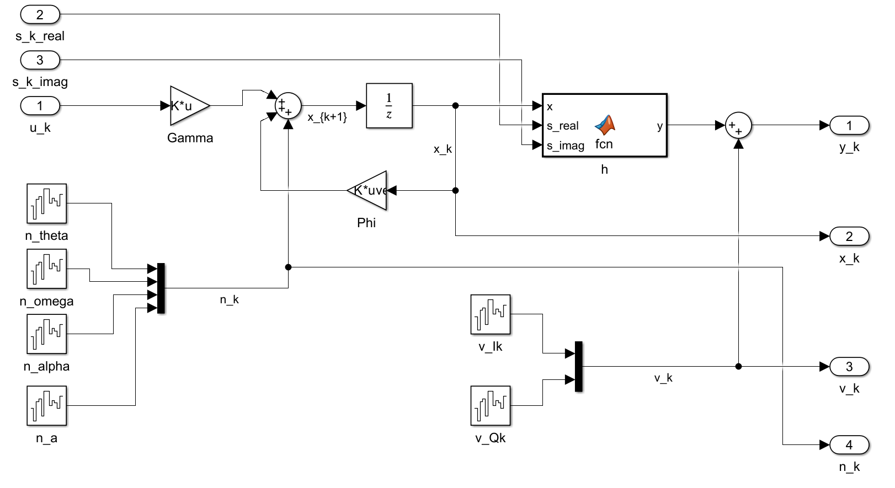
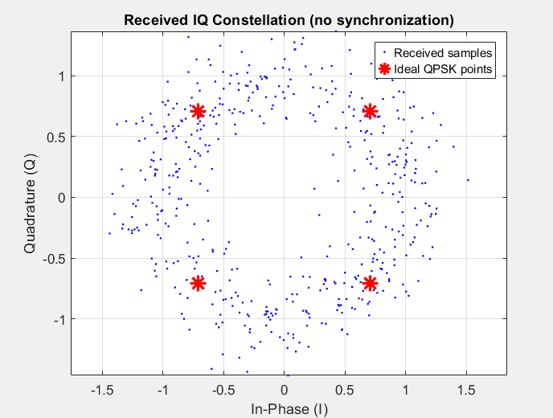
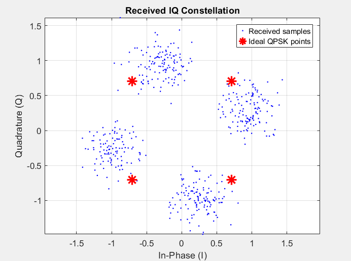
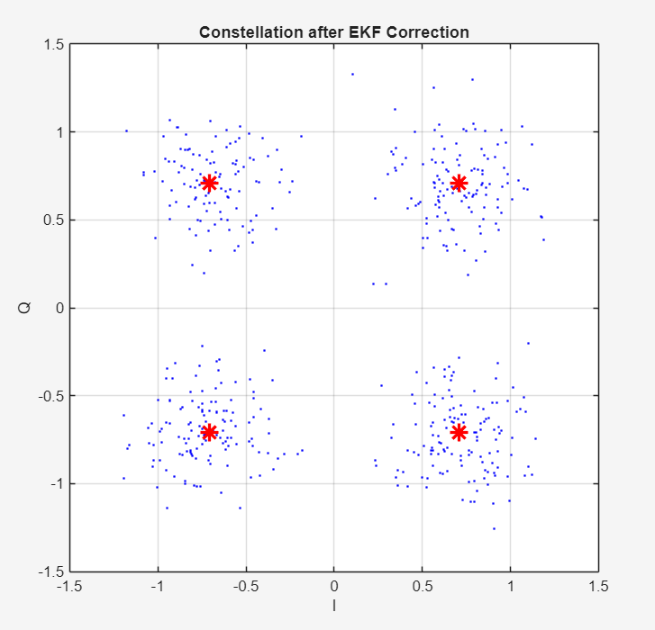

## Project Summary

This project simulates the effects of receiving a wireless signal that has been altered by carrier offsets and channel noise. I modeled the channel effects as a nonlinear state space system and then implemented an Extended Kalman Filter (EKF) to estimate these offsets and correct them. I decided to apply this to a quadrature shift phase keying (QPSK) modulation scheme since it is widely used in satellite communications which regularly have to correct doppler shifts. I am stil working on the real-time offset correction to turn this into a phase-locked loop (PLL) and potentially implement on a microcontroller. The simulation and algorithms were developed with Matlab and Simulink.


## Background
In a digital communication system, accurate demodulation requires the receiver to maintain synchronization with the incoming RF carrier. In practice, several physical effects distort the received signal and make this challenging. 

One of the most prominent effects is carrier frequency offset (CFO) which occurs when the receiver's local oscillator is not perfectly synchronized with the transmitter's. This can occur due to oscillator inaccuracies or Doppler shifts. These frequency offsets accumulate over time and result in a rotating phase in the received baseband signal.

Additional distortions include signal amplitude variations due to channel fading and additive noise from receiver electronics.

Together, these distortions make accurate symbol detection difficult, and the receiver must estimate these carrier offsets in order to recover the transmitted symbol.

---

## System Model

### QPSK Signal

In QPSK, each transmitted symbol sits on one of four constellation points on the unit circle, each separated by 90°:

$$s_k \in \left\{ \frac{\pm 1 \pm j}{\sqrt{2}} \right\}$$

The received baseband signal after passing through the channel is modeled as:

$$
r_k=a_k s_k e^{j\theta_k}+v_k
$$

where the distortions are $\theta_k$, the carrier phase offset, $a_k$, the signal amplitude, and $v_k \sim \mathcal{CN}(0,\sigma^2)$, complex additive white Gaussian noise (AWGN).

Separating into real and imaginary components gives the in-phase (I) and quadrature (Q) components of the received symbol:
$$
\begin{aligned}
\Re(r_k) &= a_k \big( \Re(s_k)\cos\theta_k - \Im(s_k)\sin\theta_k \big) + \Re(v_k), \\
\Im(r_k) &= a_k \big( \Re(s_k)\sin\theta_k + \Im(s_k)\cos\theta_k \big) + \Im(v_k).
\end{aligned}
$$

### State Vector

I chose states based on real world phenomena. A fast-moving satellite will introduce a varying frequency shift due to the doppler effect. In addition, the amplitude will be affected by channel noise. The following four internal states were tracked by the estimator:

| State | Symbol | Description |
|---|---|---|
| Carrier phase | $\theta_k$ | Instantaneous phase offset |
| Frequency offset | $\omega_k$ | CFO from oscillator mismatch |
| Frequency drift | $\alpha_k$ | Rate of change of frequency offset |
| Signal amplitude | $a_k$ | Channel fading amplitude |

This gives a state vector $x_k$:
$$
x_k =
\begin{bmatrix}
\theta_k \\
\omega_k \\
\alpha_k \\
a_k
\end{bmatrix}.
$$

### State Equations

The state equations were derived from the integrator relationships between $\theta_k$ and $\omega_k$. For this project, the integration is expanded to include frequency drift $\alpha_k$ which is the discrete-time change in $\omega_k$.

The input $u_k$ is applied to the receiver oscillator which allows adjustment of the frequency offset. This input influences both phase and frequency due to their integrator relationship. In this model, $u_k$ appears in both the phase and frequency equations with a gain of $T$ in the phase equation reflecting the integration of frequency over one symbol period, and a gain of $1$ in the frequency equation as a direct offset correction.
    
Furthermore, for model simplicity, the amplitude $a_k$ is modeled as a random walk driven by process noise. 

Lastly, for each state, a random noise variable in the vector $n_k \sim \mathcal{N}(0,Q)$ is added to finalize the state equation for this system:

$$
\begin{aligned}
\theta_{k+1} &= \theta_k + T\omega_k + \frac{T^2}{2}\alpha_k- T u_k + n_{\theta,k} \\
\omega_{k+1} &= \omega_k + T\alpha_k - u_k + n_{\omega,k} \\
\alpha_{k+1} &= \alpha_k + n_{\alpha,k} \\
a_{k+1} &= a_k + n_{a,k}
\end{aligned}
$$

The full discrete-time state equation in matrix form is:


$$
x_{k+1} =
\underbrace{
\begin{bmatrix}
1 & T & \frac{T^2}{2} & 0 \\
0 & 1 & T & 0 \\
0 & 0 & 1 & 0 \\
0 & 0 & 0 & 1
\end{bmatrix}
}_{\Phi}
x_k
+
\underbrace{
\begin{bmatrix}
-T \\
-1 \\
0 \\
0
\end{bmatrix}
}_{\Gamma}
u_k + n_k
$$

or simply:

$$x_{k+1}=\Phi x_k + \Gamma u_k + n_k$$

### Measurement Equation

The measurement is the received IQ sample, split into in-phase and quadrature components with added measurement noise $v_k \sim \mathcal{N}(0,R)$:

$$
y_k = h(x_k, s_k) + v_k
$$

$$
h =
\begin{bmatrix}
a_k\big(\Re(s_k)\cos\theta_k - \Im(s_k)\sin\theta_k\big) \\
a_k\big(\Re(s_k)\sin\theta_k + \Im(s_k)\cos\theta_k\big)
\end{bmatrix}
$$

The transmitted symbol $s_k$ is assumed known at the receiver from pilot symbols. The process model is linear; the measurement equation is nonlinear, which justifies the use of the EKF rather over the standard Kalman filter.

---

## Simulation Parameters

| Parameter | Value |
|---|---|
| Number of symbols N | 500 |
| Symbol period T | 1×10⁻⁴ s |
| Symbol rate | 10,000 symbols/s |
| Initial phase offset $\theta_0$ | π/3 rad |
| Initial frequency offset $\omega_0$ | 2π×200 rad/s |
| Initial frequency drift $\alpha_0$ | 2π×0.5 rad/s² |
| Initial amplitude $a_0$ | 1.0 |
| SNR | 10 dB |
---

## Channel Distortion Simulations

Before applying the EKF, two open-loop scenarios were simulated in Simulink to understand the effect of the carrier offsets. The plant model can be seen below:



### No Synchronization ($u_k = 0$)

To establish a baseline, the system was first simulated with no synchronization applied, meaning $u_k=0$ for all $k$. In this scenario, no correction is applied to the receiver oscillator. This allows the carrier phase and frequency offset evolve freely according to the model.



The received constellation shown in the figure above depicts a ring of samples rather than clustering. This shape occurs because the CFO causes the constellation to rotate continuously, essentially "smearing" the samples uniformly around the unit circle. This behavior is expected when there is no synchronization since the receiver has no way of accounting for the phase rotation. Furthermore, the radial thickness of the ring reflects the amplitude variation in $a_k$ over the simulation.

### Ideal Impulse Correction ($u_k = \omega_0 \cdot \delta[k]$)

To show the effect of a perfect frequency correction, a unit-impulse input was applied at $k=0$ with magnitude equal to the true frequency offset $\omega_0$. It is important to note that this scenario is not physically realizable in practice, since it assumes perfect knowledge of the frequency offset at $k=0$. However, it is useful to isolate the effect of the control input.




The CFO correction can be seen in the above figure. Instead of the constellation ring as when $u_k=0$, the received samples now cluster around four distinct regions, essentially eliminating the smearing. However, the clusters are still phase shifted from the ideal QPSK constellation points by $\theta_0 = \pi/3$. This is a result of the uncompensated initial phase offset which demonstrates the limitation of frequency-only correction. Complete synchronization must estimate and compensate all 4 internal states, not just oscillator frequency. This once again justifies the use of the EKF for state estimation.

---

## State Estimation with Extended Kalman Filter

As mentioned before, the measurement function $h$ is nonlinear due to the trigonometric dependence of the received IQ samples on the carrier phase $\theta_k$. The EKF was chosen because it linearizes $h$ about the current state estimate at each time step and applies the standard Kalman filter equations to the linearized model.

### Measurement Jacobian

Looking back at the state space system, we can see that only the measurement equation requires linearization. The EKF linearizes $h$ by computing the Jacobian matrix $H_k$, defined as the matrix of partial derivatives of $h$ with respect to each state, evaluated at the current predicted state estimate $\hat{x}_{k}^{(-)}$:

$$
H_k = \frac{\partial h}{\partial x}\Bigg|_{\hat{x}_{k}^{(-)}}
$$

The Jacobian can be expressed compactly by defining:
$$
A_k = \Re(s_k)\cos\hat{\theta}_k - \Im(s_k)\sin\hat{\theta}_k
$$
$$
B_k = \Re(s_k)\sin\hat{\theta}_k + \Im(s_k)\cos\hat{\theta}_k
$$

giving the linearized measurement matrix:

$$
H_k = \frac{\partial h}{\partial x}\Bigg|_{\hat{x}_{k}^{(-)}}=\begin{bmatrix}
-a_k*B_k & 0 & 0 &  A_k \\\\
 a_k*A_k & 0 & 0 & B_k
\end{bmatrix}
$$

Note: because $\omega_k$ and $\alpha_k$ are not present in the measurement equation, their corresponding columns are zero. They are observable only indirectly through the accumulation of phase over time.

### EKF Algorithm


The EKF operates recursively at each symbol period $k$, alternating between a measurement update step and a time propagation step.

**Initialization** — The filter starts cold with no prior knowledge of phase or frequency:

At $k=0$, the state estimate and error covariance are initialized as:

$$
\hat{x}_{0} =
\begin{bmatrix}
0 \\ 0 \\ 0 \\ a_\text{nom}
\end{bmatrix},
$$
$$
P_{0} =
\begin{bmatrix}
(\pi/2)^2 & 0 & 0 & 0 \\
0 & (2\pi \times 500)^2 & 0 & 0 \\
0 & 0 & (2\pi \times 5)^2 & 0 \\
0 & 0 & 0 & 0.25
\end{bmatrix}
$$

**Step 1 — Measurement Update:**

Given the predicted state estimate $\hat{x}_{k}^{(-)}$ and predicted covariance $P_{k}^{(-)}$ from the previous propagation step, the EKF update equations are:

$$
\bar{K_k} = P^{(-)}_{k} H_k^T (H_k P^{(-)}_{k} H_k^T + R)^{-1} $$
$$
\hat{x}_{k}^{(+)} = \hat{x}_{k}^{(-)} + \bar{K_k} (y_k - h(\hat{x}_{k}^{(-)}, s_k))
$$
$$
P_{k}^{(+)} = (I - \bar{K_k} H_k) P_{k}^{(-)} (I - \bar{K_k} H_k)^T + \bar{K_k} R \bar{K_k}^T
$$

**Step 2 — Time Propagation:**

After the measurement update, the state estimate and covariance are propagated forward one symbol period using the linear process model:

$$
\hat{x}_{k+1}^{(-)} = \Phi\, \hat{x}_{k}^{(+)} + \Gamma u_k 
$$
$$
P_{k+1}^{(-)} = \Phi\, P_{k}^{(+)}\, \Phi^T + Q
$$

Because the process model is linear, no Jacobian is required in the prediction step. All linearization error in the EKF is confined to the measurement update.

### Matlab EKF Implementation

The recursive algorithm was implemented in matlab using the system results from the simulink open-loop model. The following snippet shows the EKF loop at each timestep $k$:

```matlab
for k = 1:n_samples

    %% Step 1: Measurement Update
    sk = s(k);    % known pilot symbol
    s_re = real(sk);
    s_im = imag(sk);
    theta = x_hat(1);
    a = x_hat(4);

    % Predicted measurement h
    h = [a*(s_re*cos(theta) - s_im*sin(theta));
         a*(s_re*sin(theta) + s_im*cos(theta))];

    % Calculating Jacobian
    dh_dtheta_I = -a*(s_re*sin(theta) + s_im*cos(theta));
    dh_dtheta_Q = a*(s_re*cos(theta) - s_im*sin(theta));
    dh_da_I = s_re*cos(theta) - s_im*sin(theta);
    dh_da_Q = s_re*sin(theta) + s_im*cos(theta);

    H = [dh_dtheta_I, 0, 0, dh_da_I;
         dh_dtheta_Q, 0, 0, dh_da_Q];

    % Kalman gain
    K = P * H' / (H * P * H' + R);

    % State update
    y_k = y_meas_sim(k,:)';
    x_hat = x_hat + K * (y_k - h);

    % Covariance update
    IKH = eye(4) - K*H;
    P = IKH * P * IKH' + K * R * K';

    % Store results
    x_est(k,:) = x_hat';
    P_diag(k,:) = diag(P)';
    K_log(k,:) = K(:,1)';

    %% Step 2: Time Propagation
    if k < n_samples
        x_hat = Phi * x_hat + Gamma * u_vec(k);
        P = Phi * P * Phi' + Q;
    end
end
```

---

## Signal Correction and Symbol Recovery

To isolate the transmitted symbol $s_k$, the received sample is rotated by the negative of the estimated phase offset and normalized by the estimated amplitude:

$$
\tilde{r}_k = \frac{r_k \cdot e^{-j\hat{\theta}_k}}{\hat{a}_k}
$$
Substituting the signal model:
$$
\tilde{r}_k = \frac{a_k s_k e^{j\theta_k} e^{-j\hat{\theta}_k} + v_k e^{-j\hat{\theta}_k}}{\hat{a}_k} \approx s_k + \tilde{v}_k
$$
As the EKF converges and $\hat{\theta}_k \to \theta_k$ and $\hat{a}_k \to a_k$, the corrected sample approaches the ideal transmitted symbol plus residual noise only ($\tilde{v}_k$). A nearest-neighbor decision rule then maps each corrected sample to the closest QPSK constellation point:

$$
\hat{s}_k = \underset{s \in \mathcal{S}}{\arg\min}\ |\tilde{r}_k - s|
$$

```matlab
% Rotate received samples back by estimated phase
r_received  = y_meas_sim(:,1) + 1j*y_meas_sim(:,2);
r_corrected = r_received .* exp(-1j*x_est(:,1)) / mean(x_est(:,4));
```

The decided symbol $\hat{s}_k$ is taken as the estimate of the transmitted symbol. The effect of the EKF offset estimation and correction can be seen in the figure below by the clustering of symbols around the 4 QPSK constellation points: 



---

## Active Controller Design (Incomplete)

In the current implementation, the oscillator correction input $u_k$ is held at zero throughout the simulation and correction is applied as a post-processing step. In a fully closed-loop receiver, the EKF frequency estimate would be fed back to drive the oscillator in real time:

$$u_k = \hat{\omega}^{(+)}_k$$

This would actively reduce the frequency offset at each step, shrinking the residual the filter needs to track and improving both convergence speed and steady-state accuracy. This would essentially be the implementation of a phase locked loop (PLL) which is the next step that I will work on.

---

## Tools Used

- **MATLAB** — EKF implementation, signal correction, constellation plots
- **Simulink** — Open-loop state-space plant model

[View on GitHub →](https://github.com/scast3/qpsk_receiver)