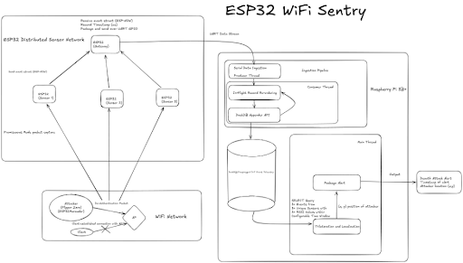
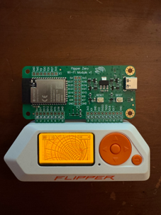
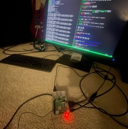
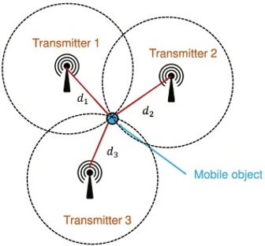

## Overview

Along with with [W. Schageman](https://github.com/wallyschag), developed an intrusion detection system to detect and triangulate the source of WiFi jamming via deauthentication attacks, common in network disruptions. ESP32(s) scan for deauth/dissoc packets in promiscuous mode, relaying alerts to a Raspberry Pi server for logging and analysis. Use Flipper Zero (with WiFi module/ESP32 marauder) to simulate deauthentication attacks in a lab environment. RSSI localization done via least squares multilateration.

## System Architecture & Components
The system is divided into a distributed data acquisition network and a centralized processing core. 

*   **Attacker Simulation Node**: A Flipper Zero equipped with an ESP32 WiFi Development Board running the ESP32 WiFi Marauder firmware. This node simulates real world network disruptions by generating thousands of spoofed 802.11 deauthentication packets per second.
*   **Distributed Sensor Network**: Three separate ESP32 sensors powered by portable battery packs. These nodes scan the RF spectrum in promiscuous mode to intercept raw 802.11 frames and harvest critical RSSI data.
*   **ESP32 Gateway**: A localized receiver hub that receives incoming ESP-NOW packets from the sensor nodes and forwards them to the primary compute module over a hardware UART serial interface.
*   **Central Compute Module (Raspberry Pi 3B+)**: The core server responsible for asynchronous data ingestion, timestamp synchronization, in-memory storage, and spatial localization calculations.

All testing was done on our own private WiFi networks
Testing in any other public or private space without permission is prohibited and illegal

### Sensor Firmware
The firmware for the ESP32s is implemented in C utilizing the ESP-IDF
*   **Promiscuous Mode Interception**: Sensors bypass standard MAC filtering to capture raw management frames across specified WiFi channels.
*   **Sliding Window Detection**: Rather than flooding the network with individual alerts, sensors use a temporal sliding window to detect spikes in deauthentication/disassociation frame frequencies.
*   **Event Struct Serialization**: When an attack threshold is crossed, the sensor constructs an 'Event' data structure. This aggregated payload is transmitted over the ESP-NOW protocol directly to the gateway, optimizing bandwidth and power consumption.
*   **Gateway Stream Ingestion**: The ESP32 Gateway receives the ESP-NOW payloads, casts the raw bytes back into the standardized 'Event' data type, appends a timestamp, and pushes the data into the hardware UART stream.

### Raspberry Pi Processing Pipeline
The server software on the Pi is written in C++ and has a multithreaded architecture for guarantee real-time processing without blocking high-frequency UART data ingestion.

The system splits execution across 3 threads:

The producer thread reads the raw incoming byte stream from the UART interface, casts them to 'Event', and pushes them into a thread-safe shared queue.

The consumer thread pops items off the shared queue, bucket-sorts the events based on their timestamps within an established window, and performs efficient batch insertions into an in-memory DuckDB database.

The main thread queries the structured data out of DuckDB to do the localization matrix math and trigger active alerting mechanisms.

## Threat Localization
To pinpoint the spatial location of the attacker, the main thread extracts synchronized RSSI signatures registered by the three discrete ESP32 sensor coordinates during the same attack window. 

*   **Signal Propagation Modeling**: RSSI values are converted into relative distance estimates using the Log-Distance Path Loss model.
*   **Least Squares Multilateration**: The system treats the estimated distances as intersecting circles centered at each known sensor coordinate. It formulates an overdetermined system of non-linear geometric equations and resolves the optimal $X,Y$ coordinate of the attacker using a least-squares optimization matrix.

[View on GitHub →](https://github.com/scast3/deauth_detect)